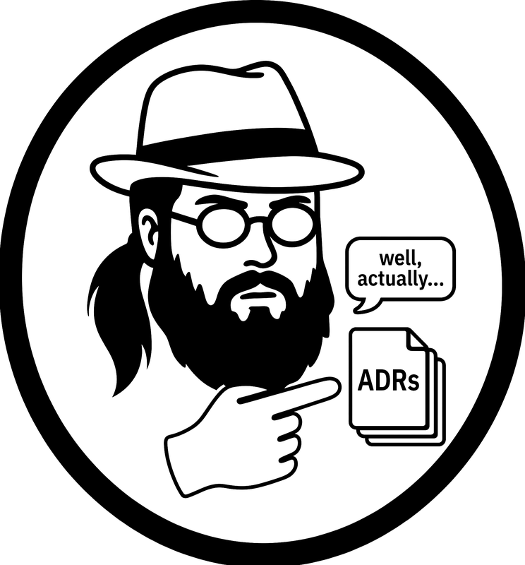
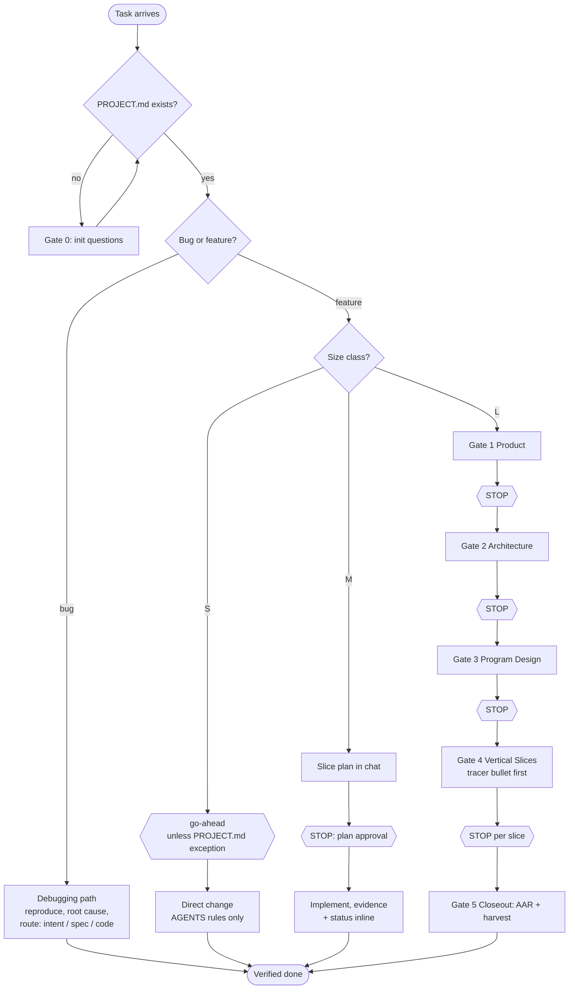
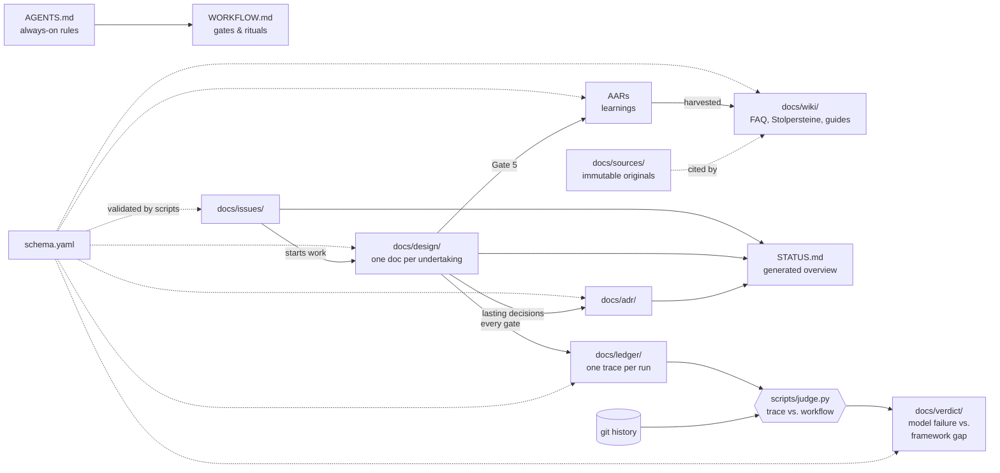

  <picture>
    <source media="(prefers-color-scheme: dark)" srcset="assets/logo-dark.png">
    
  </picture>

# Neckbeard

*Well, actually — there’s an ADR for that.*

A small, portable methodology for working with coding agents (Claude
Code, GPT-OSS harnesses, others). Everything is standard Markdown with
YAML frontmatter in a Git repo: readable in GitLab, browsable as an
Obsidian vault, validated deterministically by scripts. Rules live in
`AGENTS.md`, process lives in `WORKFLOW.md`, decisions live in ADRs,
learnings live in AARs — and the framework documents itself with its
own artifacts.

Its working assumption: **a rule that leaves no trace cannot be checked
by anyone, so it is decoration.** Every rule therefore either has a script
that contradicts it, or it says out loud that it has none. A run leaves a
ledger; `scripts/judge.py` reads it back against the workflow, and
`judge.py --coverage` reports which rules are observable at all.

## How work flows

Every `STOP` / `go-ahead` is an explicit human approval. By default
**every size class has at least one**: S a one-line go-ahead, M a
single plan approval, L a stop per gate and per slice. The only
waivable approval is size S's go-ahead — solely via the exception
asked once at Gate 0 and recorded in `PROJECT.md`. M and L have no
exception mechanism, by design.

## How the documents relate

Read direction: issues start work, design docs carry it through the
gates, lasting decisions become ADRs, learnings become AARs, and AARs
are harvested into the wiki — with original sources preserved and
cited. `STATUS.md` is generated from frontmatter; never edit it by hand.

The lower path is the framework checking itself. A run writes a **ledger**
— a row per gate carrying its commit, its approval and its status, plus
the walk of the reuse ladder. `judge.py` reads that against `WORKFLOW.md`
*and against git*, which is the only part of the trace its own author did
not write. What no script can weigh — is a design doc real or filler —
goes to a second judge that runs in fresh context and files a **verdict**.
See ADR-0010.

## This branch: vendored ponytail

`main` expects [ponytail](https://github.com/DietrichGebert/ponytail)
as a marketplace plugin. This branch instead carries its instruction-only
ruleset, skills and commands under [vendor/ponytail/](vendor/ponytail/VENDORED.md)
(MIT, notice included) — for air-gapped or locked-down environments
without marketplace access. Refresh via `scripts/vendor-ponytail.sh`.

That makes the reuse ladder doubly present on this line: as the rule in
`AGENTS.md` §1, and as the full ruleset it was distilled from. Since
v0.3.0 the ladder also owes an entry in the run's ledger — searched,
found, outcome — so that following it and skipping it stop looking the
same.

## Adopting this in a new project

1. **Copy everything except `PROJECT.md`.** Its absence is what triggers
   Gate 0 in your project, so there is deliberately none here.
2. **Vendor the same files unchanged** under
   `docs/sources/upstream/<version>/`. That is the byte-compare baseline
   which keeps agents from silently rewriting the framework files. Write
   a short provenance note beside it saying which upstream commit it came
   from, and — this is the part that bites later — **which of your files
   are held byte-identical and which are deliberately extended.** A
   vendored file in neither list is compared by nothing.
3. **Set your project-section marker.** Your own always-on rules go into a
   marked section *appended below* the upstream content of `AGENTS.md`,
   never woven into it. Put your marker in `schema.yaml` as
   `project_section_marker` — `validate.py` uses it to know where the
   upstream part ends, and your own section may then link freely.
4. **Start your agent.** Its first action must be the Gate 0 questions;
   the answers become your `PROJECT.md`.
5. **Wire CI.** On every push: `validate.py`, `gen_status.py --check`,
   your byte-compare against the baseline, and the positive control of
   every check you copied — `check_harvest.py --selftest`,
   `check_locked.py --selftest`, `judge.py --selftest`. Those controls
   build a throwaway git repository, so the job's image needs `git`.
   `check_locked.py`'s real run additionally needs unshallow history and
   a base commit to compare against.
6. **Work.** For anything non-trivial the agent proposes a size class,
   follows `WORKFLOW.md`, and writes a ledger under `docs/ledger/`.

⚠️ **Upgrading later is a deliberate act, not a copy.** Replace baseline
and working copies in one commit; reconcile by hand any file you declared
extended, because nothing compares those for you; and check that the
byte-identical ones still are. The first real upgrade of the first adopter
found this path broken at step one — see
`docs/aar/2026-08-21-an-adoption-path-that-could-not-be-followed.md`. It is
described here because it has now actually been walked.

## Repository layout

| Path | Purpose |
|---|---|
| `AGENTS.md` / `CLAUDE.md` | Canonical agent rules / pointer to them |
| `WORKFLOW.md` | Gate 0–5, size classes, debugging, handoff, refinement |
| `schema.yaml` | Single source of truth for artifact frontmatter |
| `STATUS.md` | Generated overview — issues, active designs, ADRs |
| `docs/adr/` | Architecture Decision Records (binding, superseded-only) |
| `docs/design/` | Design docs per undertaking; finished ones in `done/` |
| `docs/aar/` | Standalone After Action Reviews (incidents) |
| `docs/issues/` | In-repo issues, status in frontmatter |
| `docs/wiki/` | Wiki areas as folders, created on demand |
| `docs/sources/` | Immutable original sources, cited by wiki pages |
| `docs/ledger/` | One trace per run: a row per gate, plus the reuse-ladder walk |
| `docs/verdict/` | Judged runs — findings split into model failure vs. framework gap |
| `scripts/` | Deterministic tooling: `validate.py`, `gen_status.py`, and the check family — `check_harvest.py`, `check_locked.py`, `judge.py`, each with a built-in positive control |

## Influences & prior art

Built on the author's own experience with different frameworks and AI
agents, plus ideas deliberately taken (and credited) from:

- [Andrej Karpathy](https://gist.github.com/karpathy/442a6bf555914893e9891c11519de94f) — the LLM-wiki pattern (persistent Markdown knowledge base, index-first navigation) and the behavioral-guideline lineage behind the four operating rules.
- [Dex Horthy / HumanLayer](https://www.humanlayer.com/) — the four gates (product → architecture → program design → vertical slices), context-window economics, "the doc is the memory".
- [12-factor agents](https://github.com/humanlayer/12-factor-agents) — own your context window.
- [PAUL](https://github.com/ChristopherKahler/paul) — escalation statuses, diagnostic failure routing, boundaries, the files/action/verify/done task rule.
- [superpowers](https://github.com/obra/superpowers) — systematic debugging, verification-before-completion, plan granularity.
- [ponytail](https://github.com/DietrichGebert/ponytail) — the reuse-before-build ladder and its safety floor (MIT); also the reference for multi-harness packaging (see Issue-0003).
- Frank Coyle (Berkeley) — neurosymbolic guardrails: surround probabilistic output with deterministic checks; realized here as schema-first validation (ADR-0004).
- [Google Open Knowledge Format](https://github.com/GoogleCloudPlatform/knowledge-catalog) — design reference for the frontmatter schema (not adopted as a second standard; see ADR-0004).
- Victor Taelin — the closing question: "which choices did you make that you're least confident about?"
- Hunt & Thomas, *The Pragmatic Programmer* — tracer bullets, the origin of Gate 4's slice-1 rule.
- Eliyahu Goldratt, *The Goal* — inefficiencies are not bottlenecks; the reason chrome (dashboards) stays in the backlog.

## Why it is built this way

The reasoning is recorded where this framework says reasoning belongs:
in its own ADRs.

**Start here:** `0001` canonical AGENTS.md · `0002` in-repo issues ·
`0003` portable Markdown · `0004` schema-first validation and its growth
stages · `0005` MIT license.

**Then the ones the field wrote:** `0006` versioning and release tags ·
`0007` release cadence — corrections now, structural harvest after
stage-2 evidence · `0008` a harvest carries failure classes, never adopter
specifics · `0009` recurring patterns live as wiki pages with a harvest
state · `0010` a judge reads traces, so every rule owes one.

Numbers 0007 through 0010 exist because a real project adopted this and
handed back what wore out. That is the intended direction of travel, and
`WORKFLOW.md`'s *Harvesting to the Framework* is the rule for it.
