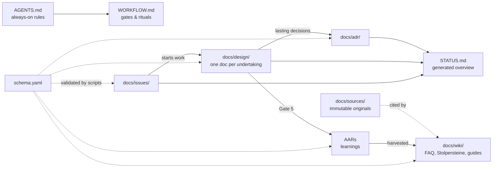

# Neckbeard

*Well, actually — there’s an ADR for that.*

A small, portable methodology for working with coding agents (Claude
Code, GPT-OSS harnesses, others). Everything is standard Markdown with
YAML frontmatter in a Git repo: readable in GitLab, browsable as an
Obsidian vault, validated deterministically by scripts. Rules live in
`AGENTS.md`, process lives in `WORKFLOW.md`, decisions live in ADRs,
learnings live in AARs — and the framework documents itself with its
own artifacts.

## How work flows

Every `STOP` / `go-ahead` is an explicit human approval. By default
**every size class has at least one**: S a one-line go-ahead, M a
single plan approval, L a stop per gate and per slice. The only
waivable approval is size S's go-ahead — solely via the exception
asked once at Gate 0 and recorded in `PROJECT.md`. M and L have no
exception mechanism, by design.

## How the documents relate

Read direction: issues start work, design docs carry it through the
gates, lasting decisions become ADRs, learnings become AARs, and AARs
are harvested into the wiki — with original sources preserved and
cited. `STATUS.md` is generated from frontmatter; never edit it by hand.

## This branch: vendored ponytail

`main` expects [ponytail](https://github.com/DietrichGebert/ponytail)
as a marketplace plugin. This branch instead carries its instruction-only
ruleset, skills and commands under [vendor/ponytail/](vendor/ponytail/VENDORED.md)
(MIT, notice included) — for air-gapped or locked-down environments
without marketplace access. Refresh via `scripts/vendor-ponytail.sh`.

## Adopting this in a new project

1. Copy everything **except** `PROJECT.md` into the new repo
   (there is deliberately none in this template — its absence is what
   triggers Gate 0 in your project).
2. Start your agent. Its first action must be the Gate 0 questions;
   the answers become your `PROJECT.md`.
3. Work. For anything non-trivial the agent proposes a size class and
   follows `WORKFLOW.md`.
4. Wire CI: run `scripts/validate.py` and `scripts/gen_status.py`
   on every push (see `.gitlab-ci.yml` once present).

## Repository layout

| Path | Purpose |
|---|---|
| `AGENTS.md` / `CLAUDE.md` | Canonical agent rules / pointer to them |
| `WORKFLOW.md` | Gate 0–5, size classes, debugging, handoff, refinement |
| `schema.yaml` | Single source of truth for artifact frontmatter |
| `STATUS.md` | Generated overview — issues, active designs, ADRs |
| `docs/adr/` | Architecture Decision Records (binding, superseded-only) |
| `docs/design/` | Design docs per undertaking; finished ones in `done/` |
| `docs/aar/` | Standalone After Action Reviews (incidents) |
| `docs/issues/` | In-repo issues, status in frontmatter |
| `docs/wiki/` | Wiki areas as folders, created on demand |
| `docs/sources/` | Immutable original sources, cited by wiki pages |
| `scripts/` | Deterministic tooling (validation, status generation) |

## Influences & prior art

Built on the author's own experience with different frameworks and AI
agents, plus ideas deliberately taken (and credited) from:

- [Andrej Karpathy](https://gist.github.com/karpathy/442a6bf555914893e9891c11519de94f) — the LLM-wiki pattern (persistent Markdown knowledge base, index-first navigation) and the behavioral-guideline lineage behind the four operating rules.
- [Dex Horthy / HumanLayer](https://www.humanlayer.com/) — the four gates (product → architecture → program design → vertical slices), context-window economics, "the doc is the memory".
- [12-factor agents](https://github.com/humanlayer/12-factor-agents) — own your context window.
- [PAUL](https://github.com/ChristopherKahler/paul) — escalation statuses, diagnostic failure routing, boundaries, the files/action/verify/done task rule.
- [superpowers](https://github.com/obra/superpowers) — systematic debugging, verification-before-completion, plan granularity.
- [ponytail](https://github.com/DietrichGebert/ponytail) — the reuse-before-build ladder and its safety floor (MIT); also the reference for multi-harness packaging (see Issue-0003).
- Frank Coyle (Berkeley) — neurosymbolic guardrails: surround probabilistic output with deterministic checks; realized here as schema-first validation (ADR-0004).
- [Google Open Knowledge Format](https://github.com/GoogleCloudPlatform/knowledge-catalog) — design reference for the frontmatter schema (not adopted as a second standard; see ADR-0004).
- Victor Taelin — the closing question: "which choices did you make that you're least confident about?"
- Hunt & Thomas, *The Pragmatic Programmer* — tracer bullets, the origin of Gate 4's slice-1 rule.
- Eliyahu Goldratt, *The Goal* — inefficiencies are not bottlenecks; the reason chrome (dashboards) stays in the backlog.

## Why it is built this way

The reasoning is recorded where this framework says reasoning belongs:
in its own ADRs. Start with `docs/adr/0001` (canonical AGENTS.md),
`0002` (in-repo issues), `0003` (portable Markdown), and `0004`
(schema-first validation and its growth stages).
