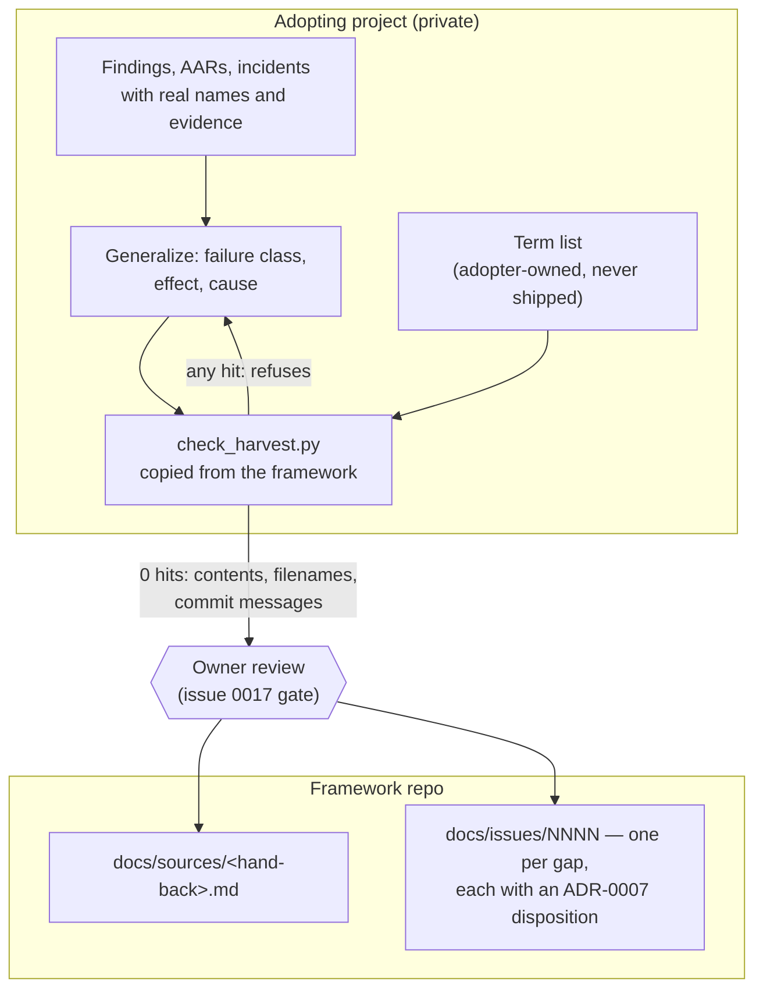

# Design: Second hand-back — sustained-operation findings, and a harvest rule that cannot leak

## Gate 1 — Product

**Problem.** Two problems, deliberately taken together because the second
one governs how the first may be delivered.

*First:* the framework has now been in continuous field use for about a
week and a half beyond its adoption. The first hand-back
(`docs/sources/feldtest-first-adoption-2026-08.md`, 2026-08-13) reported
what was missing while a project was being *migrated onto* the framework.
Since then the same adopter has been *running* on it — and recorded
**eleven recurring deviation patterns** plus a series of incidents, most
of them not adoption gaps at all but wear patterns that only appear under
sustained use. None of them are filed here, so the next iteration cannot
cover them. The adopter's own summary of the cost: too many errors, and
they cost time, money and nerves. That is the trigger for this
undertaking, not a tidying impulse.

The single strongest of the eleven is structural and worth stating up
front, because it explains most of the others: **every rule in the
framework that had a script contradicting it was kept without exception,
and every rule without one was broken or ignored.** The rules that went
unfollowed are the judgement rules in the always-on section — and an
adopting project cannot add enforcement there, because that section is
held byte-identical against the vendored baseline. Whatever answer exists
has to come from here.

*Second:* the hand-back procedure itself is underspecified. `WORKFLOW.md`
tells a Gate-5 closeout that "a missing or wrong framework rule becomes a
framework issue or update", and the refinement ritual says "propose
framework changes". Neither says **what may travel** — and on 2026-08-13
that gap produced a near-leak in this very repo: adopter names, an open
protection gap and stack components reached a pushed commit, and
propagation was prevented only because a mirror token happened to be
expired. The remediation held (measured below), but the *rule* that would
have prevented it exists only as one project's issue, 0017, which is a
gate for this repo's publication rather than a rule for every harvest
that any adopter will ever send. A framework that collects one adopter's
specifics is compromised for the next adopter.

**Acceptance criterion.**

1. **Nothing unaccounted.** Each of the adopter's eleven deviation
   patterns is either filed as a new issue in `docs/issues/`, or mapped
   to an existing issue in 0004–0018 with the mapping written down.
   Count of patterns with neither: **0**.
2. **Anonymity is measured, not asserted.** A committed term list plus a
   check that runs over the whole repo reports **0** adopter-, product-,
   domain-, tooling- or infrastructure-specific terms in everything this
   undertaking adds. The check is repeatable by anyone later, which is
   the point — the near-leak came from a negative that was asserted after
   a look, not measured.
3. **The harvest rule is in the framework, not in an issue.** A reader
   who has never seen the adopting project can apply it from
   `WORKFLOW.md` alone, and it names concretely what must be stripped
   (adopter and product names, hostnames, stack components, people, paths,
   commit hashes, ticket ids) and what must survive (failure class,
   effect, cause, and the framework change it argues for).
4. **Nothing leaves the machine.** At the end of this undertaking the
   branch exists locally with the push URL disabled, and the owner has
   reviewed it before any push is even possible.

**Non-goals.**

- **No publication and no push.** Not to this repo's origin, not outward.
  The branch is prepared for review; pushing is a separate, owner-driven
  act under the 0017 gate.
- **No v1.0 decision.** ADR-0007 set the cadence; this hand-back is input
  to that decision, not the decision.
- **No history rewrite** of any kind. The 2026-08-13 rewrite is done and
  its mapping is recorded; nothing here reopens it.
- **No re-litigation of issues 0004–0018.** Where a new pattern is
  already covered, it is mapped and closed out — not restated.
- **No repair of this repo's residual identity exposure.** The measurement
  below shows what remains; that is 0017's subject and the owner's call,
  and it predates this hand-back.
- **No adopter-side work.** The adopter's own remediation, evidence and
  raw record stay in its private repository and are referenced only by
  opaque identifiers.

**Announcement.** This is the framework's second field report, and the
first one written from sustained use rather than from adoption. It says
what wore out over a week and a half of daily operation: which rules held,
which were quietly ignored, and the one structural reason that separates
the two. It is for whoever decides what the next version of the framework
must cover — and, because a field report is exactly the thing that tends
to smuggle a project's private detail into a public framework, it also
brings the rule that keeps every future report clean, backed by a check
that can be run instead of trusted.

**Mockups.** No UI involved.

> **Gate 1 approved by the owner, 2026-08-20**, with one architecture
> instruction carried into Gate 2: *the mechanism belongs here, the term
> list stays with the adopter.*

## Gate 2 — Architecture

**Inputs read.**

- **ADR-0001** (AGENTS.md canonical) — rules have exactly one home. A
  harvest rule must land in the framework's own files, not in a side
  document that adopters would have to be told about separately.
- **ADR-0002** (in-repo issues) — hand-back items become files under
  `docs/issues/`; the repo is the source of truth.
- **ADR-0003** (portable Markdown) — no wikilinks, frontmatter as the
  only structured carrier, Mermaid as the only diagram format. Binds the
  form of everything below.
- **ADR-0004** (schema-first validation) — `validate.py` is
  authoritative and agents never invent fields. This is why *disposition*
  stays prose in the issue body, exactly as issues 0004–0018 already do,
  instead of becoming a new frontmatter field.
- **ADR-0005** (MIT) — whatever ships here is copied by adopters, so the
  new mechanism must be dependency-free to stay copyable.
- **ADR-0006** (versioning) — 0.x; the tag message carries the "what";
  no CHANGELOG.
- **ADR-0007** (release cadence) — the decisive input. Every hand-back
  issue carries an explicit disposition (*0.1.x now* / *after stage 2
  (0.2.0)* / *refinement decides*), and the structural harvest waits for
  **stage-2 evidence**. This undertaking is that evidence arriving.
- **AAR 2026-08-13** (hand-back near-leak) — the failure this design must
  make structurally unlikely. Two details shape the architecture: the
  leak rode in **filenames and commit messages**, not only in file
  bodies; and the exposure was an *asserted negative* — "I looked and saw
  no mirror" treated as "there is no mirror".
- **Issue 0017** (pre-publication review) — the existing gate. Measured
  today: its point 1 ("adopting project named") is **stale**, the 
  remediation held. Points 3 and 4 (stack components, personal identity)
  still stand. Reported, not repaired — repair is out of scope per Gate 1.
- **Issue 0012** (runtime check family) — the new mechanism is the first
  upstream member of that family, so it must obey the principles the
  issue already records: *"cannot check" is a finding, not a skip; abort
  instead of silently skipping; project lists read at runtime, never
  maintained in code.* The last of those is precisely the owner's Gate-1
  instruction, already written down here from the first field test.
- **Issue 0015** (commit-time anonymisation) — establishes that this
  repo's own commit metadata is in scope for exposure questions. Confirms
  that a harvest check that reads only working-tree files is incomplete.

**System fit.**

The harvest is a one-way flow from an adopting project into this repo.
Everything on the left of the boundary is private and stays private; only
generalized statements cross. The check sits **at the source**, because
only the adopter knows its own proper nouns:

Concretely, three kinds of change land here:

1. **`docs/sources/<hand-back>.md`** — a new source document in the
   established form of the first one: opaque evidence identifiers
   pointing at the adopter's private record, roles instead of names. New
   file only; nothing existing under `docs/sources/` is touched, which
   keeps the immutability rule in `AGENTS.md` §4 intact.
2. **`docs/issues/0019+`** — one issue per gap that is not already
   covered by 0004–0018, in the short hand-back form those issues use
   (title, disposition line, one paragraph, evidence pointer) rather than
   the fuller template form. Gaps that *are* covered get their mapping
   recorded in the source document instead of a duplicate issue.
3. **The harvest rule itself** — `WORKFLOW.md`, extending the two places
   that already speak about harvesting (Gate 5's *Harvest* bullet and
   the refinement ritual's *AAR harvest* item) plus one short section
   they both point at, and one new ADR that makes the rule binding.

**Constraints.**

- **Dependency-free, stdlib only.** The mechanism is copied into adopter
  repos the way `validate.py` is; a dependency would not survive the copy.
- **Three surfaces, not one.** Contents, filenames and commit messages —
  the near-leak used two of the three.
- **Fails closed.** A missing, empty or unreadable term list is an error,
  never a pass. Same rule as the rest of the check family (0012).
- **No false confidence.** A denylist is necessarily incomplete: it can
  only find nouns someone thought of. It therefore *supplements* the 0017
  owner review and never replaces it — and the rule text has to say so,
  or the check becomes the next asserted negative.
- **Offline.** No network, consistent with `validate.py` being
  offline-deterministic by design.
- **Portable across the boundary.** The framework must not learn the
  adopter's vocabulary even in an example; sample lists ship as
  *categories*, never as terms.

**Options & trade-offs.**

*How the check decides what is forbidden.*

- **A — Denylist of adopter-supplied terms. (chosen)** Finds exactly the
  nouns that matter and needs no knowledge of the adopter here. Con:
  catches only what someone listed; a forgotten name passes. Mitigated by
  the fails-closed rule and by keeping the human gate.
- **B — Allowlist of permitted vocabulary.** Theoretically airtight.
  Rejected: prose is open-vocabulary, so an allowlist either blocks
  ordinary English or has to be so large it stops meaning anything.
- **C — Human review only.** That is the status quo, and it produced the
  near-leak. Rejected as the sole measure, retained as the second layer.

*Where the term list lives.* Owner's instruction: with the adopter. This
matches 0012's principle that project lists are read at runtime and never
maintained in code, and it is also the only placement that does not force
the framework to store the very names it must not know.

*Where the rule lives.*

- **A — `WORKFLOW.md`. (chosen)** Harvesting is already described there,
  in two places. Extending them is the second rung of the ladder; a new
  document would be a third home for one subject.
- **B — `AGENTS.md`.** Wrong register: that file is the always-on rule
  set, and harvesting happens at a closeout, not continuously.
- **C — A new `HARVEST.md`.** Rejected: nothing to gain that a section
  does not give, and one more file every adopter must be told about.

*Which release this feeds.* Not decided here — ADR-0007 reserves it for
the owner. What the evidence shows: the stage-2 trigger reads "the
product line developed to completion under the migrated system, its AARs
and a result analysis on the table." Two of three are unambiguously met
(AARs exist in number; this document is the result analysis). "Developed
to completion" is only **partly** met — a release shipped and was
accepted, but the product line still has open work. The honest reading is
that stage-2 evidence has *begun* arriving rather than concluded, which
argues for filing the new issues with dispositions and letting the
refinement rule on 0.2.0. This is the call I am least sure of and it is
the owner's to make.

**New ADRs.**

One. **ADR-0008 — A harvest carries failure classes, never adopter
specifics.** It is lasting and binding, it constrains every future
adopter and not just this hand-back, and it is the rule whose absence is
documented by an AAR — which is exactly what ADR-0004's "decisions are
ADRs" is for. It will record: what must be stripped (adopter, product and
domain names; hostnames and paths; stack components; people; commit
hashes; ticket and issue identifiers of the adopter), what must survive
(failure class, effect, cause, and the framework change it argues for),
that the check is a supplement to human review and not a substitute, and
that the term list is adopter-owned by design.

No second ADR: the check's placement and its fails-closed behaviour are
consequences of ADR-0008 and of 0012's already-recorded principles, not
independent decisions.

> **STOP — awaiting Gate 2 approval.**
