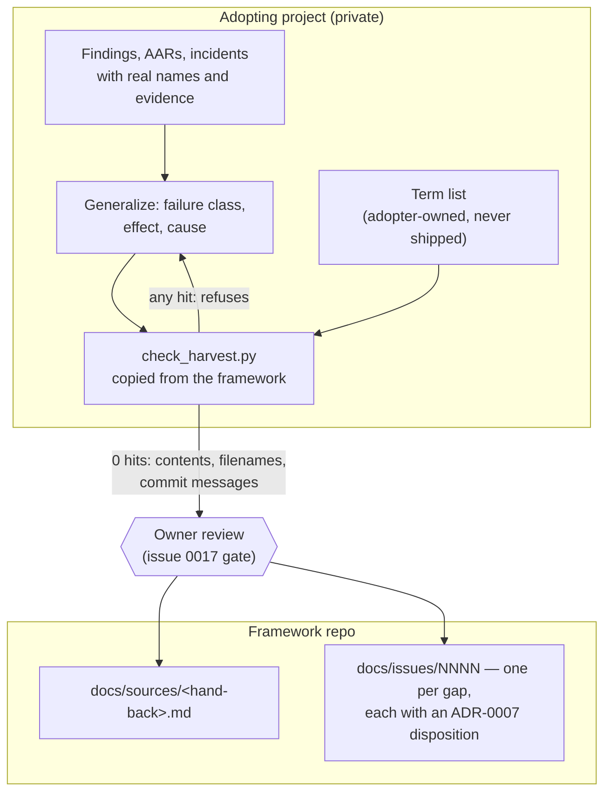

# Design: Second hand-back — sustained-operation findings, and a harvest rule that cannot leak

## Gate 1 — Product

**Problem.** Two problems, deliberately taken together because the second
one governs how the first may be delivered.

*First:* the framework has now been in continuous field use for about a
week and a half beyond its adoption. The first hand-back
(`docs/sources/feldtest-first-adoption-2026-08.md`, 2026-08-13) reported
what was missing while a project was being *migrated onto* the framework.
Since then the same adopter has been *running* on it — and recorded
**eleven recurring deviation patterns** plus a series of incidents, most
of them not adoption gaps at all but wear patterns that only appear under
sustained use. None of them are filed here, so the next iteration cannot
cover them. The adopter's own summary of the cost: too many errors, and
they cost time, money and nerves. That is the trigger for this
undertaking, not a tidying impulse.

The single strongest of the eleven is structural and worth stating up
front, because it explains most of the others: **every rule in the
framework that had a script contradicting it was kept without exception,
and every rule without one was broken or ignored.** The rules that went
unfollowed are the judgement rules in the always-on section — and an
adopting project cannot add enforcement there, because that section is
held byte-identical against the vendored baseline. Whatever answer exists
has to come from here.

*Second:* the hand-back procedure itself is underspecified. `WORKFLOW.md`
tells a Gate-5 closeout that "a missing or wrong framework rule becomes a
framework issue or update", and the refinement ritual says "propose
framework changes". Neither says **what may travel** — and on 2026-08-13
that gap produced a near-leak in this very repo: adopter names, an open
protection gap and stack components reached a pushed commit, and
propagation was prevented only because a mirror token happened to be
expired. The remediation held (measured below), but the *rule* that would
have prevented it exists only as one project's issue, 0017, which is a
gate for this repo's publication rather than a rule for every harvest
that any adopter will ever send. A framework that collects one adopter's
specifics is compromised for the next adopter.

**Acceptance criterion.**

1. **Nothing unaccounted.** Each of the adopter's eleven deviation
   patterns is either filed as a new issue in `docs/issues/`, or mapped
   to an existing issue in 0004–0018 with the mapping written down.
   Count of patterns with neither: **0**.
2. **Anonymity is measured, not asserted.** A committed term list plus a
   check that runs over the whole repo reports **0** adopter-, product-,
   domain-, tooling- or infrastructure-specific terms in everything this
   undertaking adds. The check is repeatable by anyone later, which is
   the point — the near-leak came from a negative that was asserted after
   a look, not measured.
3. **The harvest rule is in the framework, not in an issue.** A reader
   who has never seen the adopting project can apply it from
   `WORKFLOW.md` alone, and it names concretely what must be stripped
   (adopter and product names, hostnames, stack components, people, paths,
   commit hashes, ticket ids) and what must survive (failure class,
   effect, cause, and the framework change it argues for).
4. **Nothing leaves the machine.** At the end of this undertaking the
   branch exists locally with the push URL disabled, and the owner has
   reviewed it before any push is even possible.

**Non-goals.**

- **No publication and no push.** Not to this repo's origin, not outward.
  The branch is prepared for review; pushing is a separate, owner-driven
  act under the 0017 gate.
- **No v1.0 decision.** ADR-0007 set the cadence; this hand-back is input
  to that decision, not the decision.
- **No history rewrite** of any kind. The 2026-08-13 rewrite is done and
  its mapping is recorded; nothing here reopens it.
- **No re-litigation of issues 0004–0018.** Where a new pattern is
  already covered, it is mapped and closed out — not restated.
- **No repair of this repo's residual identity exposure.** The measurement
  below shows what remains; that is 0017's subject and the owner's call,
  and it predates this hand-back.
- **No adopter-side work.** The adopter's own remediation, evidence and
  raw record stay in its private repository and are referenced only by
  opaque identifiers.

**Announcement.** This is the framework's second field report, and the
first one written from sustained use rather than from adoption. It says
what wore out over a week and a half of daily operation: which rules held,
which were quietly ignored, and the one structural reason that separates
the two. It is for whoever decides what the next version of the framework
must cover — and, because a field report is exactly the thing that tends
to smuggle a project's private detail into a public framework, it also
brings the rule that keeps every future report clean, backed by a check
that can be run instead of trusted.

**Mockups.** No UI involved.

> **Gate 1 approved by the owner, 2026-08-20**, with one architecture
> instruction carried into Gate 2: *the mechanism belongs here, the term
> list stays with the adopter.*

## Gate 2 — Architecture

**Inputs read.**

- **ADR-0001** (AGENTS.md canonical) — rules have exactly one home. A
  harvest rule must land in the framework's own files, not in a side
  document that adopters would have to be told about separately.
- **ADR-0002** (in-repo issues) — hand-back items become files under
  `docs/issues/`; the repo is the source of truth.
- **ADR-0003** (portable Markdown) — no wikilinks, frontmatter as the
  only structured carrier, Mermaid as the only diagram format. Binds the
  form of everything below.
- **ADR-0004** (schema-first validation) — `validate.py` is
  authoritative and agents never invent fields. This is why *disposition*
  stays prose in the issue body, exactly as issues 0004–0018 already do,
  instead of becoming a new frontmatter field.
- **ADR-0005** (MIT) — whatever ships here is copied by adopters, so the
  new mechanism must be dependency-free to stay copyable.
- **ADR-0006** (versioning) — 0.x; the tag message carries the "what";
  no CHANGELOG.
- **ADR-0007** (release cadence) — the decisive input. Every hand-back
  issue carries an explicit disposition (*0.1.x now* / *after stage 2
  (0.2.0)* / *refinement decides*), and the structural harvest waits for
  **stage-2 evidence**. This undertaking is that evidence arriving.
- **AAR 2026-08-13** (hand-back near-leak) — the failure this design must
  make structurally unlikely. Two details shape the architecture: the
  leak rode in **filenames and commit messages**, not only in file
  bodies; and the exposure was an *asserted negative* — "I looked and saw
  no mirror" treated as "there is no mirror".
- **Issue 0017** (pre-publication review) — the existing gate. Measured
  today: its point 1 ("adopting project named") is **stale**, the 
  remediation held. Points 3 and 4 (stack components, personal identity)
  still stand. Reported, not repaired — repair is out of scope per Gate 1.
- **Issue 0012** (runtime check family) — the new mechanism is the first
  upstream member of that family, so it must obey the principles the
  issue already records: *"cannot check" is a finding, not a skip; abort
  instead of silently skipping; project lists read at runtime, never
  maintained in code.* The last of those is precisely the owner's Gate-1
  instruction, already written down here from the first field test.
- **Issue 0015** (commit-time anonymisation) — establishes that this
  repo's own commit metadata is in scope for exposure questions. Confirms
  that a harvest check that reads only working-tree files is incomplete.

**System fit.**

The harvest is a one-way flow from an adopting project into this repo.
Everything on the left of the boundary is private and stays private; only
generalized statements cross. The check sits **at the source**, because
only the adopter knows its own proper nouns:



Concretely, three kinds of change land here:

1. **`docs/sources/<hand-back>.md`** — a new source document in the
   established form of the first one: opaque evidence identifiers
   pointing at the adopter's private record, roles instead of names. New
   file only; nothing existing under `docs/sources/` is touched, which
   keeps the immutability rule in `AGENTS.md` §4 intact.
2. **`docs/issues/0019+`** — one issue per gap that is not already
   covered by 0004–0018, in the short hand-back form those issues use
   (title, disposition line, one paragraph, evidence pointer) rather than
   the fuller template form. Gaps that *are* covered get their mapping
   recorded in the source document instead of a duplicate issue.
3. **The harvest rule itself** — `WORKFLOW.md`, extending the two places
   that already speak about harvesting (Gate 5's *Harvest* bullet and
   the refinement ritual's *AAR harvest* item) plus one short section
   they both point at, and one new ADR that makes the rule binding.

**Constraints.**

- **Dependency-free, stdlib only.** The mechanism is copied into adopter
  repos the way `validate.py` is; a dependency would not survive the copy.
- **Three surfaces, not one.** Contents, filenames and commit messages —
  the near-leak used two of the three.
- **Fails closed.** A missing, empty or unreadable term list is an error,
  never a pass. Same rule as the rest of the check family (0012).
- **No false confidence.** A denylist is necessarily incomplete: it can
  only find nouns someone thought of. It therefore *supplements* the 0017
  owner review and never replaces it — and the rule text has to say so,
  or the check becomes the next asserted negative.
- **Offline.** No network, consistent with `validate.py` being
  offline-deterministic by design.
- **Portable across the boundary.** The framework must not learn the
  adopter's vocabulary even in an example; sample lists ship as
  *categories*, never as terms.

**Options & trade-offs.**

*How the check decides what is forbidden.*

- **A — Denylist of adopter-supplied terms. (chosen)** Finds exactly the
  nouns that matter and needs no knowledge of the adopter here. Con:
  catches only what someone listed; a forgotten name passes. Mitigated by
  the fails-closed rule and by keeping the human gate.
- **B — Allowlist of permitted vocabulary.** Theoretically airtight.
  Rejected: prose is open-vocabulary, so an allowlist either blocks
  ordinary English or has to be so large it stops meaning anything.
- **C — Human review only.** That is the status quo, and it produced the
  near-leak. Rejected as the sole measure, retained as the second layer.

*Where the term list lives.* Owner's instruction: with the adopter. This
matches 0012's principle that project lists are read at runtime and never
maintained in code, and it is also the only placement that does not force
the framework to store the very names it must not know.

*Where the rule lives.*

- **A — `WORKFLOW.md`. (chosen)** Harvesting is already described there,
  in two places. Extending them is the second rung of the ladder; a new
  document would be a third home for one subject.
- **B — `AGENTS.md`.** Wrong register: that file is the always-on rule
  set, and harvesting happens at a closeout, not continuously.
- **C — A new `HARVEST.md`.** Rejected: nothing to gain that a section
  does not give, and one more file every adopter must be told about.

*Which release this feeds.* Not decided here — ADR-0007 reserves it for
the owner. What the evidence shows: the stage-2 trigger reads "the
product line developed to completion under the migrated system, its AARs
and a result analysis on the table." Two of three are unambiguously met
(AARs exist in number; this document is the result analysis). "Developed
to completion" is only **partly** met — a release shipped and was
accepted, but the product line still has open work. The honest reading is
that stage-2 evidence has *begun* arriving rather than concluded, which
argues for filing the new issues with dispositions and letting the
refinement rule on 0.2.0. This is the call I am least sure of and it is
the owner's to make.

**New ADRs.**

One. **ADR-0008 — A harvest carries failure classes, never adopter
specifics.** It is lasting and binding, it constrains every future
adopter and not just this hand-back, and it is the rule whose absence is
documented by an AAR — which is exactly what ADR-0004's "decisions are
ADRs" is for. It will record: what must be stripped (adopter, product and
domain names; hostnames and paths; stack components; people; commit
hashes; ticket and issue identifiers of the adopter), what must survive
(failure class, effect, cause, and the framework change it argues for),
that the check is a supplement to human review and not a substitute, and
that the term list is adopter-owned by design.

No second ADR: the check's placement and its fails-closed behaviour are
consequences of ADR-0008 and of 0012's already-recorded principles, not
independent decisions.

> **Gate 2 approved by the owner, 2026-08-20.**

## Gate 3 — Program Design

**Files.**

*New:*

| Path | What it is |
|---|---|
| `scripts/check_harvest.py` | The mechanism. Stdlib only — the term list is a plain text file, so nothing here needs PyYAML. |
| `docs/adr/0008-harvest-carries-classes-not-adopter-specifics.md` | The binding rule. |
| `docs/sources/feldtest-sustained-operation-2026-08.md` | The hand-back digest. Filename carries no adopter noun — the first leak rode in a filename. |
| `docs/issues/0019-unenforced-rules-in-the-byte-true-section.md` | Rules with no machine contradictor go unfollowed; adopters cannot add enforcement where the rules live. |
| `docs/issues/0020-aar-duty-has-no-trigger.md` | The closeout duty fires only on human attention. |
| `docs/issues/0021-a-new-check-must-be-proven-to-fail.md` | A check only ever seen green is a hypothesis. |
| `docs/issues/0022-acknowledgements-with-mandatory-expiry.md` | Checks accumulate findings nobody can fix, then stop meaning anything. |
| `docs/issues/0023-append-only-artifacts-go-stale-at-the-head.md` | Heads and titles keep asserting what the appendices already refuted. |
| `docs/issues/0024-created-is-not-delivering-data.md` | An artifact counts as done when it exists, not when it produces a result. |
| `docs/issues/0025-checks-measure-the-wrong-instance.md` | A check that cannot name what it measured proves nothing. |
| `docs/issues/0026-locked-artifacts-have-no-mechanical-protection.md` | "Binding, never edited" is prose; nothing contradicts an edit. |
| `docs/issues/0027-read-first-produces-no-evidence.md` | Gate 2 says read the ADRs and AARs first; nothing records whether that happened. |

*Touched:*

| Path | Change |
|---|---|
| `WORKFLOW.md` | Gate 5's *Harvest* bullet and the refinement ritual's *AAR harvest* item each gain one sentence pointing at a new short section, **Harvesting to the framework**, which carries the rule. |
| `.gitlab-ci.yml` | One line in the existing `validate` job: `python scripts/check_harvest.py --selftest`. The real check cannot run here — this repo has no adopter list, by design — but the *mechanism* must be proven to still work, or adopters copy a broken tool. |
| `STATUS.md` | Regenerated by `gen_status.py`. Never hand-edited. |
| this design doc | `related` grows as issues are created. |

Nine issues, not eleven: two adopter patterns about stale document heads
collapse into 0023, and two about unfollowed known rules collapse into
0019. The mapping — all eleven accounted for, including the two that map
onto existing issues rather than new ones — is written into the source
document, which is where acceptance criterion 1 is discharged.

**Signatures.**

```python
class HarvestError(RuntimeError):
    """The check could not answer the question. Never a pass."""

class Finding(NamedTuple):
    surface: str          # "content" | "filename" | "commit"
    where: str            # path, or commit sha
    line: int | None      # None for filenames and commit subjects
    term: str
    excerpt: str          # the matching line, trimmed

def load_terms(path: Path) -> list[str]: ...
def git(root: Path, *args: str) -> str: ...          # raises HarvestError
def scan_text(text, terms, *, surface, where) -> list[Finding]: ...
def scan_files(paths: list[Path], terms) -> list[Finding]: ...   # bodies + names
def scan_commits(root: Path, rev_range: str, terms) -> list[Finding]: ...
def report(findings: list[Finding]) -> None: ...
def selftest() -> int: ...
def main(argv: list[str]) -> int: ...
```

CLI: `check_harvest.py --terms <file> [--range <a>..<b>] [path ...]`,
plus `--selftest`. Matching is case-insensitive **substring**, not
word-boundary — see shakiest calls.

**Call stack.**

```
main
├── --selftest → selftest → (builds a throwaway repo, runs the three scanners)
└── normal run
    ├── load_terms          → HarvestError if missing, empty or unreadable
    ├── scan_files          → contents and filenames of the given paths
    ├── scan_commits        → git log over the range; HarvestError if unresolvable
    ├── report              → grouped by surface, excerpt per finding
    └── exit 1 if findings else 0
```

**Test assertions.** No test framework exists here, and adding one for a
single script would be the wrong rung. The positive control lives inside
the script as `--selftest`, which builds a throwaway git repository and
asserts:

1. A listed term in a **file body** is found, with the correct line number.
2. A listed term in a **filename** is found while that file's body is clean.
3. A listed term in a **commit message** is found while the tree is clean.
4. A term listed in lower case is found in a capitalized occurrence.
5. A **missing or empty** term list raises `HarvestError` — exit non-zero,
   never "no findings".
6. An **unresolvable** rev range raises `HarvestError` — the failure mode
   that turned an error into a silent pass in the adopter's own
   implementation of a comparable check.
7. Clean input against a non-empty list exits **0** — the negative
   control, without which a check that is always red would pass its own
   test.

Assertions 5–7 are the ones that matter: they are the difference between
a check and a hypothesis, which is the same thing issue 0021 argues the
framework should require of everyone.

**Boundaries — DO NOT CHANGE.**

- `docs/sources/feldtest-first-adoption-2026-08.md` — immutable source.
- `docs/adr/0001`–`0007` — binding; never edited, only superseded.
- `docs/issues/0004`–`0018` — not touched, not renumbered, not
  reworded. Where a new finding lands on one of them, the mapping goes
  into the new source document.
- `AGENTS.md`, `schema.yaml`, `validate.py`, `gen_status.py` — untouched.
  No new frontmatter field; *disposition* stays prose (ADR-0004).
- `LICENSE`, `PROJECT.md`, `docs/aar/2026-08-09-neckbeard-v1-creation.md`
  — the residual identity exposure is issue 0017's subject, not this
  undertaking's.
- Git history — no rewrite of any kind.
- The push URL stays `DISABLED-no-push`. Nothing leaves the machine in
  this undertaking.

**Shakiest calls.**

1. **Substring matching over word boundaries.** A product name inside a
   hostname or a compound still leaks, so substring is the safer default
   — but it produces false positives on short or common terms, and a
   noisy check is a check people learn to bypass. Mitigation: the list is
   the adopter's, so terms can be made specific, and every finding prints
   its line so dismissal is cheap. I am not certain this is the right
   default and it is the one thing I would revisit after first use.

   *Measured while writing this gate:* a trial list flagged this very
   document over a forge name — which the framework itself uses in ten of
   its own files. So the rule is not only "the list is the adopter's" but
   **"a term the framework already uses cannot be on it"**: such a term
   is shared vocabulary, not an adopter secret, and putting it on the
   list produces noise that trains people to ignore the check. Gate 4
   builds this constraint into how the list is specified.
2. **The rev range in practice.** Before a push the natural range is
   `origin/main..HEAD`, which does not resolve on a fresh branch with no
   upstream. Failing closed is correct and will still be irritating; the
   alternative — quietly falling back to "all commits" — is the exact
   failure class this whole undertaking is about, so the irritation is
   deliberate.
3. **Collapsing eleven patterns into nine issues.** Defensible, but the
   two collapses are my judgement, and someone reading only the issues
   would not see that two distinct patterns fed each of them. The source
   document carries the full mapping precisely because of this.
4. **Issue 0027 is the weakest of the nine.** "Read first, and prove it"
   may be unenforceable by any framework, in which case the honest answer
   is that it is behaviour and not a framework gap. Filed anyway, with
   that doubt written into the issue rather than hidden.
5. **The version question from Gate 2 is still open** and is the owner's.
   Nothing in Gate 3 depends on the answer: the issues carry dispositions
   either way.

> **Gate 3 approved by the owner, 2026-08-20.**

## Gate 4 — Vertical Slices

### Slice 1 — Tracer bullet: the mechanism, end to end

- [x] **Build the check** — files: `scripts/check_harvest.py` — action:
  three scanners (contents, filenames, commit messages), fails closed,
  built-in positive control — verify: `--selftest` — done: all assertions
  pass **and** each is shown to fail when the code it guards is broken.
- [x] **Run it for real** — files: the branch itself — action: run with an
  adopter term list held outside the repository — verify: zero findings
  over what this harvest adds, and a deliberately planted adopter name is
  caught — done: both observed.

**Evidence.**

*Positive control, twelve assertions:*

```
ok  1 term in a file body is found, with its line number
ok  2 term in a filename is found while the body is clean
ok  3 term in a commit message is found while the tree is clean
ok  4 a lower-case term matches a capitalized occurrence
ok  5 the excerpt masks the term instead of repeating it
ok  6 an empty term list raises instead of passing
ok  7 a missing term list raises instead of passing
ok  8 an unresolvable range raises instead of reporting nothing
ok  9 clean input against a non-empty list finds nothing
ok 10 a bare term does not match inside an unrelated word
ok 11 a *term* does match inside a word, when opted into
ok 12 with a range, exactly that range's files are read
selftest: 12 assertions passed
```

*The control was itself controlled.* A suite only ever seen green is a
hypothesis, so five deliberate breaks were introduced one at a time, each
caught by exactly the assertion that guards it:

| Break | Failed |
|---|---|
| `git()` returns `""` instead of raising | 8 |
| comparison made case-sensitive | 1, 3, 4 |
| empty term list waved through | 6 |
| range scoping falls back to "all files" | 12 |
| word boundaries loosened to substring | 10 |

*Real run:* `no findings — 28 term(s), commits main..HEAD`, exit 0. With
an adopter name deliberately planted in this document, the same command
reported one finding, correctly located and with the term masked in the
excerpt.

**Three corrections the tracer bullet forced** — all three are design
errors from Gate 3 that only a running artifact could expose:

1. **Word boundaries replace substring matching.** The first real run
   flagged every commit trailer in this repository, because a personal
   name sits inside the ordinary English word "authored". Gate 3 named
   substring matching as the shakiest call; it was wrong within minutes of
   running. Substring is still available per term via `*term*`, for the
   rare name that hides in a compound.
2. **Scope is bound to the range.** The first run scanned every tracked
   file and returned nineteen findings, of which none belonged to this
   harvest: they were the repository's own pre-existing content, which is
   issue 0017's subject and explicitly out of scope. A harvest is checked
   against what it adds.
3. **"Shared vocabulary is not a secret" got its second case.** After the
   forge name found while writing Gate 3, a second forge name turned up
   the same way — named in this repo's own ADR about where issues live.
   Both are now excluded in the list's own comments, with the reason.

**The check caught its own author.** Immediately after the slice was
committed, the run over the branch reported two findings — both in
`check_harvest.py` itself. Documenting *why* substring matching is wrong,
I had written the adopter's real personal name into the framework's source
code, twice: once in a docstring and once in a test fixture. The tool
built to stop exactly that caught it within seconds of existing.

Two things follow, and both matter more than the fix:

- **It is not a hypothetical risk.** Between Gate 3 and this line, with
  the leak rule in front of me and while writing about it, I leaked. The
  argument that a harvest needs a mechanical check rather than care and
  attention no longer rests on the earlier incident alone.
- **The name was replaced by a fictional equivalent** (`rene` inside
  `serene`) that demonstrates the same class, and the slice commit was
  amended rather than followed by a fix. Amending an own, unpushed,
  not-yet-reviewed commit is not the history rewrite the boundaries
  forbid — and leaving the name in the branch's history would have meant
  the harvest still carried it, which is the whole point.

**A fourth surface, examined and deliberately declined.** A word-boundary
search over the branch's full log found four hits the check reports as
clean — all four the *author identity* of the commits, not their message
text. The check reads message bodies, not `%an`/`%ae`.

Extending it was the obvious move and would have been wrong. Commit
identity is a repository-wide property, not something a harvest carries
in: this framework's own history and its LICENSE hold the same name, so
the check would flag every run of every branch forever. A permanently red
check reports nothing — the adopter's own findings include that exact
pattern, and issue 0017's point 4 already has the identity question filed
for the owner to decide once.

So the boundary is now written into the script's docstring instead of
being an accident: identity is named as a surface it does not look at, and
why. A blind spot that is documented is a scope; one that is not is the
"reports success but is blind" class. The distinction is the whole reason
the paragraph exists.

*Also confirmed by the same measurement:* the pre-existing hits in
`LICENSE` and the creation AAR are **not** reported, because scope is
bound to the range. Correction 2 works as intended.

**Status:** `DONE`

> **STOP — slice review.**
