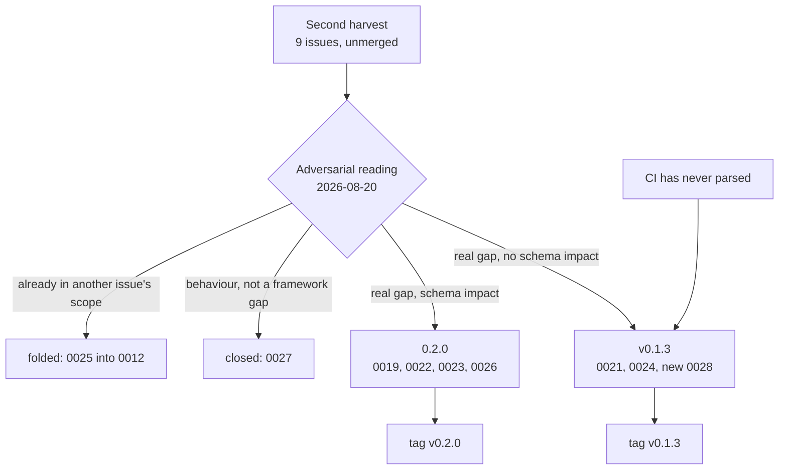

# Design: Integrating the second harvest — v0.1.3 and 0.2.0

## Gate 1 — Product

**Problem.** The second hand-back is filed but not integrated: nine
issues sit on an unmerged branch, `main` is unchanged, and nothing the
harvest argues for has reached the framework. An adversarial reading of
that harvest (owner-commissioned, 2026-08-20) produced three results that
this undertaking has to act on rather than restate:

1. **The nine issues are not nine framework gaps.** Five are real, one is
   behaviour that no framework rule can reach, two mix a structural
   finding with a behavioural one in a single file, and one duplicates the
   scope of an issue that already exists. Integrating them unchanged would
   write model failure into the rule set, which is the specific mistake the
   commission was set up to prevent.
2. **The pipeline has never run.** The configuration has not parsed since
   v0.1.1, so no job has ever been created. Until that is fixed, every
   rule this framework adds is unenforced in its own repository — while
   issue 0019 tells adopters that unenforced rules go unfollowed.
3. **One correction is blocked on a fact only the owner holds** — what
   actually carried content outward on 2026-08-13. It is not
   reconstructed here.

**Acceptance criteria.**

1. **Nothing unresolved.** Each of the nine harvest issues carries a
   recorded resolution — integrated as a rule, rescoped, folded into an
   existing issue, or closed with its reasoning. Count with none: **0**.
2. **The framework's own gate runs.** The pipeline configuration parses,
   and all four steps of the `validate` job pass under the interpreter the
   CI uses. Verified locally, because the pipeline cannot be observed from
   here.
3. **Every rule added here has a contradictor, or says why it cannot.**
   The harvest's central finding is that rules without a machine
   contradictor go unfollowed. A harvest integration that adds prose rules
   and no enforcement would refute itself on delivery.
4. **Nothing leaves the machine.** The push URL stays disabled; releases
   are tagged locally and pushed only as a separate, owner-driven act.

**Non-goals.**

- **No push, no publication.** Issue 0017 remains the gate for that.
- **No reconstruction of the disputed fact.** The AAR correction is
  prepared as far as it can be and stops where the fact is missing.
- **No re-opening of the structural issues 0007–0014.** They carry the
  ADR-0007 trigger and their own evidence needs; 0.2.0 here means the
  structural findings *of this harvest*, not every deferred item ever
  filed. Widening it would bake in designs one adopter has barely tested,
  which is the prematurity ADR-0007 exists to prevent.
- **No adopter-side work.** The upgrade path to v0.1.2 is written down for
  the adopter, not executed here.

**Announcement.** The framework's second field report has been read
adversarially and is now integrated. v0.1.3 makes the framework's own
pipeline run for the first time and adds the two rules the field evidence
supports without argument: a check owes proof that it can fail, and an
artifact whose output is the product is accepted only against evidence
that it produced one. 0.2.0 answers the structural half — where a
recurring pattern lives and how its state is tracked, and a mechanical
protection for the artifacts the rules call binding. What did not survive
the reading is named too: one issue is closed as behaviour no rule can
reach, and one is folded into the issue whose scope already covered it.

**Mockups.** No UI involved.

> **Gate 1 approved by the owner, 2026-08-21**: the assessment was
> accepted and both releases — v0.1.3 and 0.2.0 — were released for
> integration.

## Gate 2 — Architecture

**Read first.**

- **ADR-0001** — rules have one home. New rules land in `WORKFLOW.md`
  where the gate they belong to lives, not in a new document.
- **ADR-0002 / ADR-0004** — issues stay files; `schema.yaml` is
  authoritative and a new field is a schema change, not an invention at
  the point of use.
- **ADR-0006 / ADR-0007** — 0.1.x carries corrections and rule additions
  with no schema impact; a new field or artifact state is minor-level and
  belongs to 0.2.0. Both are released, so the split is a matter of putting
  each change in the release its nature dictates, not of deferral.
- **ADR-0008** — binding for everything written here: failure classes
  travel, adopter specifics never do.
- **The second hand-back digest and the nine issues** — the evidence.
- **The closed design doc of the harvest** — its Gate 5 names five open
  uncertainties; three are discharged here, one is answered by
  measurement, one is the owner's.

**System fit.** Three kinds of change land, in the release each belongs
to:



**Constraints.**

- **Criterion 3 binds the design, not just the review.** Each rule added
  here is placed where an existing script can contradict it, or is
  written with the reason it cannot be mechanised stated in the rule.
- **Dependency-free, stdlib only** — anything added is copied by adopters.
- **The CI fix lands first.** A step added to a configuration that does
  not parse is the "reports success but is blind" class, in this
  repository, in this undertaking.
- **Append-only artifacts are corrected at the head, not rewritten.** The
  framework has issue 0023 open about exactly this; the integration
  follows the rule it is about to write down.

**Options & trade-offs.**

*Where the enforcement for locked artifacts lives.*

- **A — A script in `scripts/`, wired into the `validate` job. (chosen)**
  Matches how every other rule in this framework is enforced, copies with
  the framework, and is the mechanism the field already proved against a
  real violation. Con: it can only see the push it is given, so history
  is out of scope — deliberately, because checking history would paint
  the pipeline permanently red over violations nobody can undo.
- **B — A forge-side protected-path rule.** Stronger, and not portable:
  it would live in one forge's configuration and not in the framework
  adopters copy.
- **C — Prose only.** Rejected by the harvest's own central finding.

*How a recurring pattern gets a state.* Weighed in full in ADR-0009: the
framework already has a home for patterns (`docs/wiki/`, area
`stolpersteine`) and already has the word `harvested` on the AAR type. It
lacks a state on the artifact that holds patterns. Adding the state to the
existing type is the second rung of the ladder; a new artifact type is the
seventh.

**New ADRs.** One — **ADR-0009**, recurring patterns live as wiki pages
with a harvest state. It is lasting, it constrains every adopter, and it
answers a question the field raised by inventing an artifact type. The
locked-artifact check needs no ADR of its own: it enforces a rule
`AGENTS.md` has carried since v0.1.0 and decides nothing new.

> **Gate 2 approved by the owner, 2026-08-21** with the release
> approval.

## Gate 3 — Program Design

**Files.**

*New:*

| Path | What it is | Release |
|---|---|---|
| `docs/issues/0028-closeout-must-name-what-it-refuted.md` | The half of the harvest's item 4 that needs no schema and was buried in a structural issue. | v0.1.3 |
| `docs/adr/0009-patterns-as-wiki-pages-with-a-harvest-state.md` | Where recurring patterns live, and their state. | 0.2.0 |
| `scripts/check_locked.py` | Contradicts an edit to an accepted ADR or to `docs/sources/`. | 0.2.0 |

*Touched:*

| Path | Change | Release |
|---|---|---|
| `WORKFLOW.md` | Gate 4 gains the evidence a check owes (0021) and the evidence a delivering artifact owes (0024); Gate 5 gains the counter-question (0028). | v0.1.3 |
| `docs/issues/0021`, `0024` | Closed with what was decided. | v0.1.3 |
| `docs/issues/0023` | Head correction: its evidence pointer named an item belonging to another issue. | v0.1.3 |
| `docs/issues/0025` | Closed, folded into 0012. | v0.1.3 |
| `docs/issues/0012` | Gains the principle 0025 carried. | v0.1.3 |
| `docs/issues/0027` | Closed as rejected, with the reasoning the issue already contains. | v0.1.3 |
| `docs/issues/0019` | Rescoped to the structural half; the behavioural half is named as out of scope. | 0.2.0 |
| `docs/issues/0022` | Rescoped: the half v0.1.2 already covers is removed. | 0.2.0 |
| `docs/issues/0026` | Closed by `check_locked.py`. | 0.2.0 |
| `schema.yaml` | `wiki-page` gains optional `status` and `harvested_in`. | 0.2.0 |
| `.gitlab-ci.yml` | One step: `check_locked.py` in the `validate` job. | 0.2.0 |
| `STATUS.md` | Regenerated. Never hand-edited. | both |

**Signatures** (`check_locked.py`, stdlib only):

```python
class LockError(RuntimeError):
    """The check could not answer the question. Never a pass."""

def git(root: Path, *args: str) -> str: ...        # raises LockError
def changed_paths(root: Path, rev_range: str) -> list[str]: ...
def accepted_before(root: Path, base: str, path: str) -> bool: ...
def allowed_supersede_edit(root: Path, rev_range: str, path: str) -> bool: ...
def check(root: Path, rev_range: str) -> list[str]: ...
def selftest() -> int: ...
def main(argv: list[str]) -> int: ...
```

CLI: `check_locked.py [--range <a>..<b>]`, plus `--selftest`.

**What the tests assert.** The positive control lives in the script as
`--selftest` and builds a throwaway repository:

1. An edit to an ADR that carried `accepted` before the range is reported.
2. An edit to a file under `docs/sources/` is reported.
3. A clean change is not reported — the negative control.
4. Setting only `status:` and `superseded_by:` on an accepted ADR is
   permitted, because the template prescribes exactly that edit.
5. Adding a *new* ADR with `status: accepted` is permitted — it was not
   accepted before the range.
6. An unresolvable range raises `LockError` instead of reporting nothing.

Assertion 6 is the one that matters; it is the failure mode the field
reported as having turned an error into a silent pass in its own
implementation of the same check.

**Boundaries — DO NOT CHANGE.**

- `docs/adr/0001`–`0008` — accepted; never edited, only superseded.
- `docs/sources/**` — immutable.
- `docs/design/done/**` — the harvest's own design doc is closed.
- Git history — no rewrite.
- `docs/aar/2026-08-13-hand-back-near-leak.md` — the correction is
  blocked on a fact the owner holds. Not touched, not guessed.
- The push URL stays `DISABLED-no-push`.

**Shakiest calls.**

1. **Closing 0027 as rejected.** The issue argues its own remedy down and
   says closure would be the better outcome; acting on that is still a
   judgement that a framework can never reach reading discipline. If that
   is wrong, the cost is a real gap left unfiled.
2. **Rescoping 0019 rather than splitting it into two files.** The
   behavioural half is recorded inside the issue as out of scope instead
   of getting its own closed issue. Fewer files, but a reader who wants
   the model-failure finding has to read to the end of a structural issue.
3. **`check_locked.py` reads only the range it is given.** Correct for
   the reason 0022 records, and it means a violation that reaches `main`
   through an unchecked path is never noticed afterwards.
4. **0.2.0 scoped to this harvest's structural findings.** Issues
   0007–0014 stay open. If the owner meant the full structural harvest,
   this is the line to correct.

> **Gate 3 approved by the owner, 2026-08-21** with the release approval.

## Gate 4 — Vertical Slices

### Slice 1 — Tracer bullet: make the framework's own gate run

- [x] **Land the CI fix before anything else** — files: `.gitlab-ci.yml`
  via merge of `fix/ci-yaml-multiline-push` — action: merge the existing
  branch rather than write a third fix — verify: parse the configuration
  and read back the jobs — done.
- [x] **Land the harvest** — files: the branch
  `hand-back-2026-08-20` — action: merge — verify: `validate.py`,
  `gen_status.py --check`, `check_harvest.py --selftest` under the CI
  interpreter — done.

**Evidence.** Under Python 3.12, the interpreter the CI declares:

```
.gitlab-ci.yml        parses — validate job, 4 steps, the harvest selftest last
validate.py           0 error(s), 0 warning(s)
gen_status --check    STATUS.md is current
check_harvest         selftest: 17 assertions passed
```

**The existing fix was verified rather than trusted.** Issue 0018
prescribes quoting "the argument" — one place. Measured on the real file:
repairing only the `git push` block makes the configuration parse *and
silently turns the line above it into a mapping instead of a string*. The
merged branch repairs both places, which is why it was merged rather than
re-derived. The incomplete fix would have produced a configuration that
parses and carries a broken step — the "reports success but is blind"
class, inside the fix for it.

**Status:** `DONE`

### Slice 2 — v0.1.3: the rules the evidence carries, and the issues that do not survive

- [x] **Add the two rules with no schema impact** — files: `WORKFLOW.md` —
  action: Gate 4 gains the evidence a check owes (0021) and the evidence a
  delivering artifact owes (0024) — verify: `validate.py` — done.
- [x] **Split the buried rule out** — files:
  `docs/issues/0028-closeout-must-name-what-it-refuted.md`, `WORKFLOW.md` —
  action: the half of the harvest's item 4 that needs no schema becomes its
  own issue and a Gate-5 counter-question — verify: `validate.py`,
  `gen_status --check` — done, opened and closed in the same release.
- [x] **Correct the broken evidence pointer** — files: issue 0023 —
  action: `items 4 and 6` → `item 4` — verify: the digest's item 6 belongs
  to issue 0025 — done.
- [x] **Close what does not survive the reading** — files: issues 0025,
  0027, 0012 — action: fold 0025's principle into 0012 and close it; close
  0027 as rejected — verify: `validate.py` — done.

**Evidence.** Under the CI's interpreter (3.12): `validate: 0 error(s), 0
warning(s)`; `gen_status --check: STATUS.md is current`. Harvest check over
`main..HEAD` with the adopter's term list: `no findings — 28 term(s)`.

**Criterion 3, answered honestly.** None of the three rules added here has
a script that contradicts it, and none can have one: they are evidence
rules about judgement — whether a break was genuine, whether an
observation is real, which earlier statement a piece of work refuted. A
script can count that a section exists; it cannot weigh it, and a check
that counts rituals produces findings nobody can act on, which is issue
0022's class.

What they do have is the distinction the harvest's own audit actually
draws. Every rule it found broken was an **always-on rule that nothing
stops for** — a size class nobody proposed, a completion status nobody
wrote. Every rule it found kept had something that refused to proceed.
These three sit at a gate that already ends in a mandatory STOP, so the
reviewer is the contradictor and is required to be there. That is weaker
than a script and stronger than prose, and naming which of the three a
rule has is the part worth carrying forward.

**A note on where the harvest's evidence was strongest.** The rule from
0021 is the one the harvest proved on itself: its counter-controls found
two assertions that had passed since the moment they were written and
guarded nothing. The rule is applied to this undertaking in slice 3, not
just written down in it.

**Status:** `DONE`

> **STOP — slice review.** Covered by the owner's release approval of
> 2026-08-21.

### Slice 3 — 0.2.0: state for patterns, protection for locked artifacts

- [x] **Decide where a pattern lives** — files:
  `docs/adr/0009-patterns-as-wiki-pages-with-a-harvest-state.md`,
  `schema.yaml`, `docs/wiki/index.md` — action: `wiki-page` gains optional
  `status` and `harvested_in`; the wiki rules state that a recurring
  failure class is one page and carries a state — verify: `validate.py` —
  done.
- [x] **Build the contradictor** — files: `scripts/check_locked.py` —
  action: refuse an edit to an accepted record or an immutable source,
  permit exactly the supersede edit, fail closed — verify: `--selftest`,
  **and each assertion shown to fail when the code it guards is broken** —
  done.
- [x] **Wire what can honestly be wired** — files: `.gitlab-ci.yml` —
  action: the positive control, with the reason the real run is not here —
  verify: the configuration parses and reads back five steps — done, with
  the remainder filed as issue 0029.
- [x] **Rescope what the reading changed** — files: issues 0019, 0022;
  close 0026 — done.

**Evidence.** `validate: 0 error(s), 0 warning(s)`; `gen_status --check:
STATUS.md is current`; `check_harvest --selftest: 17 assertions passed`;
`check_locked --selftest: 11 assertions passed`; `check_locked --range
v0.1.3..HEAD: no findings` — the new check run against this undertaking's
own commits; harvest check over the full range with the adopter's term
list: `no findings — 28 term(s)`.

**The control was controlled** — the rule added in v0.1.3, applied to the
first check written under it. Nine deliberate breaks, one at a time:

| Break | Failing assertions |
|---|---|
| `git()` returns `""` instead of raising | 8 |
| `was_accepted` always true | 5 |
| `was_accepted` always false | 1, 10 |
| supersede exemption always granted | 1, 10 |
| supersede exemption never granted | 4 |
| added files under sources treated as edits | 6 |
| the immutable-sources rule dropped | 2, 7 |
| `split_range` accepts anything | 9 |
| every changed path reported (permanently red) | 3, 4, 5, 6, 11 |

Eleven assertions, nine breaks, **zero uncovered**. The exercise paid for
itself once: it showed that the exemption for the ADR template was
unreachable — the template carries `status: proposed`, so the accepted
test already excludes it — and an unreachable branch is a branch no break
can fail. It was removed rather than given an assertion.

**Status:** `DONE_WITH_CONCERNS` — the mechanism is correct and proven able
to fail; this repository is not yet guarded by it, because only its control
is wired into a pipeline nobody here can observe. Filed as issue 0029 with
what "done" requires.

> **STOP — slice review.** Covered by the owner's release approval of
> 2026-08-21.

## Gate 5 — Closeout

**Planned vs. actual.** Planned: integrate the second harvest as two
releases. Delivered as planned, in three slices. Against the four
acceptance criteria:

| # | Criterion | Result |
|---|---|---|
| 1 | Every harvest issue resolved, none unaccounted | **met** — nine issues: two closed by rules, one folded, one rejected, two rescoped, one closed by a mechanism, one split and closed, one left open with its trigger |
| 2 | The framework's own gate runs | **partly met** — the configuration parses and all steps pass locally under the CI interpreter; the pipeline itself was not observed |
| 3 | Every rule added has a contradictor, or says why not | **met** — three gate rules with a mandatory stop, one mechanism with a script, each stated |
| 4 | Nothing leaves the machine | **met** — push URL disabled, no push attempted |

**Criterion 2 is the honest one.** Issue 0018 was diagnosed, fixed and
verified — but verified *locally*. The claim "the pipeline now runs" is
exactly the unverified positive this repository already has an AAR about,
so it is not made. What is proven: the configuration parses, and the five
steps of the `validate` job pass under Python 3.12. What is not: that a
runner executed them.

**What this work made false** — the Gate-5 question added in this same
undertaking, asked of itself:

- **Issue 0018's prescribed fix.** It named one place to quote; two are
  broken, and repairing one silently converts the other into a mapping.
  Corrected in the issue, with the incomplete version left standing.
- **The digest's word "without exception."** The audit behind the
  harvest's central claim rests partly on a drift check that never
  compares one of the files it vendors — measured: that file differs from
  its baseline and the check reports zero errors.

  ⚠️ *Corrected 2026-08-21, after actually attempting the upgrade.* This
  was too strong in one respect and is left standing with the correction
  beside it rather than quietly softened. The check is **not** silently
  blind: the adopter's baseline carries a provenance table that names
  exactly which files are compared byte-for-byte and which are "erklärt
  projekterweitert — nur Diff-Referenz", and the check's own pair list
  matches that table item for item. Three files are outside the rule by
  declaration, not by oversight, and the extension is documented a second
  time in the head of the adopter's schema.

  What survives: those three carry no ADR, which the adopter's own rule
  requires of every permanent exception; and nothing tells them when
  upstream changes one — the v0.1.1 → v0.3.1 reconciliation had to be
  done by hand. The absoluteness of "without exception" still does not
  hold, but the reason is a declared scope, not a hole.

  **Not corrected at the source**:
  `docs/sources/` is immutable, and as of this release a script enforces
  that. The qualification lives here instead, which is what the
  immutability rule is for.
- **The harvest's second open uncertainty.** "Whether word boundaries miss
  a real leak inside a compound is untested." Now tested: with a
  single-word term, boundary matching found one of five occurrences —
  genitive, plural and both compound positions slipped through. German
  inflection attaches exactly the characters that destroy a word boundary,
  and the field's evidence is written in German. The default stays; the
  list has to carry `*term*` for any name that inflects, and that belongs
  in the instructions for writing a list.
- **Nothing else.** `AGENTS.md`, the ADRs and the first digest are
  unaffected by this undertaking.

**Learnings.**

- **An unreachable branch is a branch no break can fail.** The counter-
  controls did not find a bug; they found a defensive condition that could
  never be true. Coverage measured by deliberate breaks tells you which
  code is load-bearing, which reading it does not.
- **A finding and a behaviour can arrive in one file, and separating them
  is most of the work.** Both of the harvest's collapses paired a
  structural finding with a behavioural one, and each collapse hid the
  cheaper half of the pair — a one-sentence rule buried under a schema
  decision, and model failure laundered into a framework gap.
- **The strongest argument for a mechanism was made by the mechanism.**
  The harvest check caught its own author writing a real name into the
  framework's source. The locked check found a dead branch in itself. In
  both cases the tool was more careful than the person building it, which
  is the entire case the field report was making.
- **"Already decided" is a distinct outcome from "not a gap."** Half of
  0022 was framework law a version before it was proposed. That is not the
  field being wrong — it is the cost of an adopter running one version
  behind, and it is an argument for the upgrade path, not against the
  finding.

**Harvested.** v0.1.3: the pipeline fix, three rules in `WORKFLOW.md`,
issues 0021, 0024, 0028 closed, 0018 closed and corrected, 0025 folded into
0012, 0027 rejected, 0023's pointer fixed and its scope narrowed. 0.2.0:
ADR-0009, the `wiki-page` state fields, `scripts/check_locked.py`, issue
0026 closed, issues 0019 and 0022 rescoped, issue 0029 opened.

**Open uncertainties** — the calls I am least confident about:

1. **Closing 0027.** A framework can require evidence of outcomes, not of
   comprehension. If that is too quick, a real gap is now unfiled.
2. **This repository is not guarded by its own new check.** Issue 0029 says
   what "done" requires, and until it is done the mechanism protects
   adopters who wire it and not this repository.
3. **0.2.0 was scoped to this harvest's structural findings.** Issues
   0007–0014 remain open with their ADR-0007 trigger. If the release
   approval meant the full structural harvest, that is the line to correct.
4. **The AAR of 2026-08-13 still asserts that this repository mirrors
   outward.** The owner has stated the opposite; the fact of what carried
   content outward that day is not reconstructable from here and was not
   guessed. The correction belongs at the head of that AAR, dated, and is
   blocked on the owner. ADR-0008 needs no supersession: its context says
   "a mirror token" without attributing the mirror, so the decision and its
   reasoning both survive the correction.

> **Gate 5 approved by the owner, 2026-08-21** with the release approval.
> On approval: `status: done`, move to `docs/design/done/`, re-run
> `gen_status.py`.
