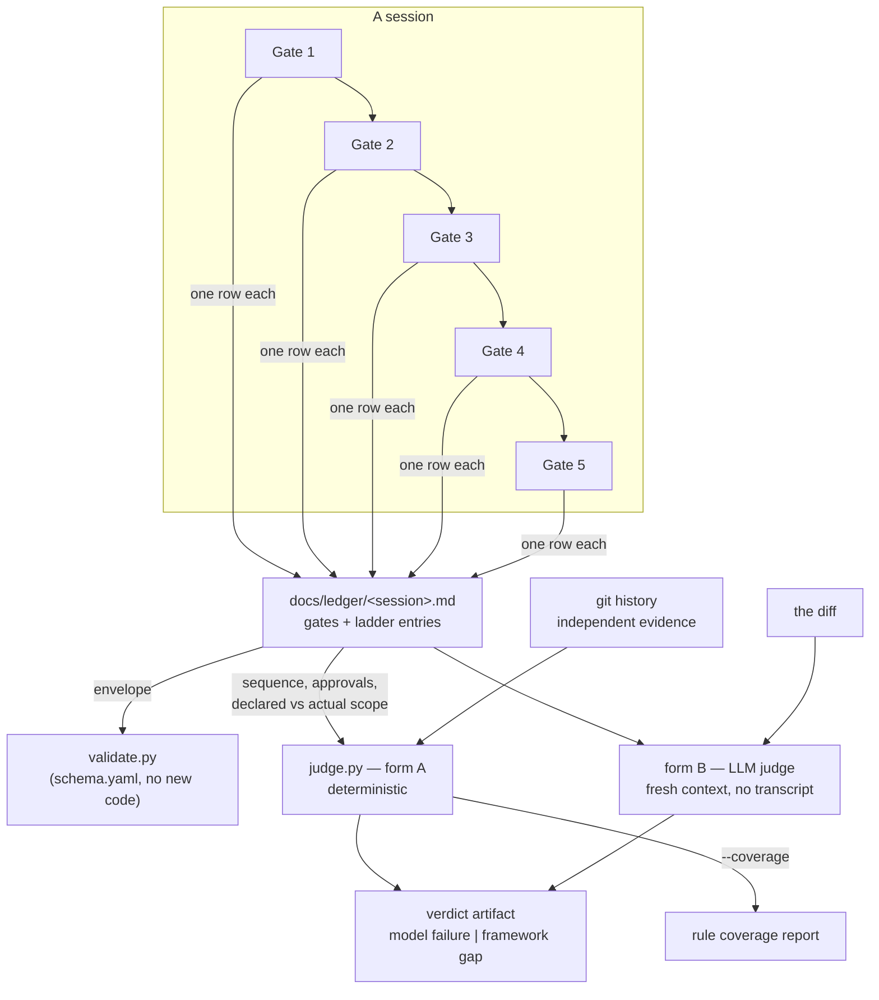

# Design: A judge, and the duty to leave a trace

## Gate 1 — Product

**Problem.** The framework cannot tell whether it was followed. Three
different things hide behind that one sentence, and only the middle one is
actually open:

1. **Artifact conformance** — frontmatter, enums, link integrity.
   `validate.py` does this. Solved.
2. **Process conformance** — was the size class proposed *before* the work
   or fitted to it afterwards? Was a gate approved before the next one
   started? This is a property of the *course of events*, not of the
   repository, and the repository cannot see it.
3. **Judgement quality** — is a design doc real or filler? Only reachable
   by inference.

The decisive move is therefore not "build a judge". A judge can only ever
examine traces, so the work is to make the process leave one. After that,
object 2 stops being an inference problem and becomes bookkeeping.

**The finding underneath all of it: silent rules.** The ponytail ladder
(`AGENTS.md` §1) tells an agent to stop at the first rung that holds
before writing new code. Following it and ignoring it leave the *same*
diff — none. Somebody who searched, found nothing reusable and then built
produces exactly the artifact of somebody who never searched. **No judge
can distinguish those, because the information does not physically
exist.** That is not a weakness of the judge; it is a gap in the
framework. The ladder has no duty to produce output.

The generalization is the real prize: **a rule with no duty to leave a
trace is decoration**, because nothing — human or machine — can ever
establish whether it held. And from that falls out a measurement the
framework has never had: **rule coverage**, counted like test coverage.
Over N runs, which rules ever fired at all? A rule at zero is either
unobservable, like the ladder is today, or inert in practice. Both are
worth knowing and both are currently invisible.

This reorders the purpose of the first run. **Instrumentation before
enforcement.** Run one does not answer "was the framework followed". It
answers "which of my rules are observable at all".

**Acceptance criteria.**

1. **A run leaves a machine-readable trace.** A session produces one
   ledger artifact; each gate is a row carrying its commit, its approval
   and its status. `validate.py` accepts it without a new validator.
2. **The ladder stops being silent.** A ledger entry names what was
   searched, what was found, and why something was built anyway. Empty
   means the gate was not passed.
3. **The judge is falsifiable and proven able to fail.** `judge.py` runs
   from stdlib against a ledger plus git, and every assertion in its
   positive control is shown to fail when the code it guards is broken.
4. **The judge cannot become permanently red.** Named in advance: which
   findings will it produce that nobody can act on? Each one is either
   designed out or carries its exception in this same change.
5. **A first coverage report exists** — every rule in `AGENTS.md` and
   `WORKFLOW.md` classified as observable or not, produced by the tool
   rather than by reading.

**Non-goals.**

- **Tamper resistance.** A ledger is written by the agent it describes.
  An agent that skipped a stop can write a ledger claiming otherwise, and
  without harness enforcement that cannot be fully prevented. The threat
  model is **drift, not sabotage** — see ADR-0010. A judge that suggests
  tamper resistance is worse than none.
- **No harness binding.** Nothing here may require a specific agent
  runtime. Hook enforcement is a plugin at the edge, not the core.
- **No judgement of past work.** Sessions before this one have no ledger.
  Their absence is not a finding; see criterion 4.
- **No CI judge yet.** Build form D waits until A is stable.

**Announcement.** The framework gets the ability to check itself, and it
turns out the hard part was never the checking. A rule that leaves no
trace cannot be verified by anyone, so the first delivery is a duty to
leave one: a session ledger with a row per gate, and three fields that
make the reuse ladder say out loud what it found. On top of that sits a
deterministic judge that reads the ledger against the workflow and the
git history, and reports the one thing nobody could measure before —
which rules in this framework are observable at all, and which are
decoration.

**Mockups.** No UI involved.

> **Gate 1 approved by the owner, 2026-08-21**, together with the two
> decisions Gate 3 records.

## Gate 2 — Architecture

**Read first.**

- **ADR-0001** — one home per rule. The judge's rubric therefore extends
  `WORKFLOW.md` rather than becoming a third document adopters must be
  told about.
- **ADR-0002** — the ledger is a file in the repo, like issues.
- **ADR-0003** — Markdown with frontmatter, no new serialization format.
  This constrains the ledger's shape more than anything else.
- **ADR-0004** — `schema.yaml` is authoritative; a new artifact type is a
  schema change, and no field may be invented at the point of use.
- **ADR-0007** — a new artifact type is minor-level.
- **Issue 0019** — rules without a machine contradictor go unfollowed,
  and adopters cannot add enforcement where those rules live. This
  undertaking is the other half of that answer: it does not add
  enforcement, it adds *observability*, which is the part an adopter
  cannot retrofit either.
- **Issue 0027** — closed as rejected: a required "records read" list
  would be satisfied by listing filenames. That closure constrains this
  design. The ladder fields must ask for something a filename cannot
  fake — concrete candidates that were considered and a reason they were
  rejected — or this rebuilds the theatre 0027 was closed to avoid.
- **Issue 0021** — a check owes proof it can fail, from where it runs.
- **Issue 0022** — findings nobody can fix make a check meaningless.

**The ladder, walked, and the rung that holds.** Required by the prompt
and doubly so for a tool aimed at silent rules.

- *Needed at all?* Yes — the measurement does not exist.
- *Codebase already has it?* **This is where it holds, partly.**
  `validate.py` is not a schema checker with hard-coded types; it is a
  generic engine driven by `schema.yaml`, with field kinds, enums,
  patterns, link resolution and a named-rule dispatch (`apply_rules`).
  A new artifact type therefore costs a schema entry and no code. The
  ledger's *envelope* — that it exists, has a valid size class, a status
  from the vocabulary, resolvable links — is validated for free.

  What the engine cannot express is the ledger's *content*: it has no
  concept of a list of records, so gate rows, their order, and their
  relation to git are outside it. That boundary is exactly the seam
  between `validate.py` and `judge.py`, and it means `judge.py` is much
  smaller than it first appeared — it never re-checks a field.
- *Stdlib?* Yes for the judge: `subprocess`, `re`, `pathlib`. The ledger
  body is a Markdown table, parsed with `re` — no YAML dependency, which
  matters because adopters copy this.

**System fit.**



**Constraints.**

- **Markdown only** (ADR-0003). The ledger is frontmatter plus tables; no
  JSON, no TSV.
- **Stdlib only**, because adopters copy the script.
- **Independent evidence, or it is just self-report.** Every ledger claim
  that *can* be cross-checked against git must be: does the named commit
  exist, is it an ancestor, do the rows' commits run in the same order as
  the gates, and does an approval point at a commit that existed when it
  was claimed.
- **Fails closed** on an unreadable ledger or an unresolvable commit —
  the house rule from the rest of the check family.
- **Never permanently red.** See below; this is a design input, not a
  review finding.

**Which unfixable findings would this produce?** Asked in advance, per
issue 0022, and each answered in the design rather than in a later
cleanup:

| Would-be finding | Why it is unfixable | Designed out how |
|---|---|---|
| Every past session has no ledger | History cannot be re-instrumented | The judge is invoked *on a ledger*. A session without one is out of scope, not a failure. |
| Rules that no trace can reach (judgement rules) | No output can prove judgement | They are reported as **unobservable in the coverage report**, never as violations. Coverage is a report, not a gate. |
| Ladder entries on work that predates the duty | Retroactive by definition | The duty binds from the release that introduces it; older ledgers are read leniently for that field. |
| Size-S work with no gates at all | S has no gates by design | The judge derives expectations *from the declared size class*, so S is judged against S. |

**Options & trade-offs.**

*Where the run's trace lives.* Decided by the owner (Gate 3). Weighed:
per-gate artifacts give the sharpest diagnosis but lose the bracket that
says which gates belonged together — which is precisely what an order
check needs; the merge request is hardest to circumvent but instruments
almost nothing today, since work in this repository goes to `main`
directly.

*Where the ladder's proof lives.* Decided by the owner (Gate 3). The
ladder applied to itself argued against a second home: a duplicate proof
in the issue template would need maintaining and cross-checking, and
ADR-0001 asks for one home per thing.

*Where the LLM judge's rubric lives.*

- **A — a section in `WORKFLOW.md`. (chosen)** Harness-neutral by
  construction: a slash-command or skill becomes a thin wrapper that
  points at it. Adopters already copy the file. Second rung of the
  ladder.
- **B — a dedicated prompt file.** Rejected: a third document every
  adopter must be told about, for content that is process.
- **C — shipped as a harness plugin.** Rejected for the core; that is
  build form C's place, at the edge.

**New ADRs.** One — **ADR-0010**, which decides A+B, places C and D, and
records the ledger's falsifiability as an explicit non-goal.

> **Gate 2 approved by the owner, 2026-08-21.**

## Gate 3 — Program Design

**The owner's two decisions**, taken before the design, as the prompt
required:

1. **A run is a session; a gate is a row inside it.** One ledger per
   session, one row per gate. This keeps gate-sharp diagnosis — each row
   carries its own commit, approval and status — while preserving the
   bracket an order check needs. Coverage can be counted per session or
   per gate without a schema change.
2. **The ladder's proof lives only in the ledger.** It fires exactly
   where there is often no tracked issue, and a second home would be
   maintenance without gain.

**Files.**

*New:*

| Path | What it is |
|---|---|
| `docs/ledger/2026-08-21-judge-and-trace-duty.md` | This session's ledger — the tracer bullet is a real one, not a fixture. |
| `scripts/judge.py` | Build form A. Stdlib, positive control built in. |
| `docs/adr/0010-judge-reads-traces-not-behaviour.md` | Decides A+B, places C and D, non-goal: tamper resistance. |
| `docs/verdict/` | Home of verdict artifacts. |

*Touched:*

| Path | Change |
|---|---|
| `schema.yaml` | Two new types: `ledger` and `verdict`. |
| `WORKFLOW.md` | The duty to leave a trace; the ladder's three fields; a *Judging a run* section carrying the rubric and the fresh-context condition. |
| `AGENTS.md` | One line in the repository map for `docs/ledger/`, and the ladder gains its output duty. |
| `.gitlab-ci.yml` | `judge.py --selftest` in the `validate` job. |
| `STATUS.md` | Regenerated. |

**The ledger's shape.** Frontmatter carries what `schema.yaml` can
express; the body carries what it cannot.

```markdown
---
type: ledger
date: 2026-08-21
size: L
status: closed          # open | closed
related: ["docs/design/..."]
---

## Gates

| gate | commit | approval | status | note |
|---|---|---|---|---|
| 1 | abc1234 | owner | DONE | ... |

## Ladder

| searched | found | built anyway because | commit |
|---|---|---|---|
| ... | ... | ... | abc1234 |
```

**Signatures.**

```python
class JudgeError(RuntimeError):
    """The check could not answer the question. Never a pass."""

class Row(NamedTuple):
    gate: str; commit: str; approval: str; status: str; note: str

class Finding(NamedTuple):
    bucket: str      # "framework-gap" | "model-failure"
    rule: str        # the rule id it belongs to
    detail: str

def parse_ledger(path: Path) -> tuple[dict, list[Row], list[Row]]: ...
def git(root: Path, *args: str) -> str: ...          # raises JudgeError
def check_gate_order(rows, size) -> list[Finding]: ...
def check_approvals(rows) -> list[Finding]: ...
def check_status_vocabulary(rows) -> list[Finding]: ...
def check_commits(root, rows) -> list[Finding]: ...   # independent evidence
def check_ladder(ladder_rows) -> list[Finding]: ...
def coverage(root: Path) -> dict[str, str]: ...       # rule -> observability
def selftest() -> int: ...
def main(argv, *, root=None) -> int: ...
```

CLI: `judge.py --ledger <file> [--root .]`, plus `--coverage` and
`--selftest`.

**What the tests assert** — the positive control, in the shape
`check_harvest.py` set:

1. A gate row out of order is reported.
2. A missing gate for a declared size L is reported.
3. Size S is *not* judged against gates it does not owe.
4. A status outside the four-value vocabulary is reported.
5. A gate row whose successor started without an approval is reported.
6. A commit that does not exist raises rather than passing.
7. A commit that is not an ancestor of HEAD is reported.
8. Rows whose commits run in a different order than their gates are
   reported — the cross-check against independent evidence.
9. An empty ladder field is reported as "gate not passed".
10. A ladder entry naming no concrete candidate is reported — the
    guard against issue 0027's theatre.
11. A clean ledger produces no findings — the negative control.
12. An unreadable ledger raises rather than reporting nothing.
13. `main()` end to end returns non-zero on a real violation.
14. `main()` end to end returns zero on a clean ledger.

**Boundaries — DO NOT CHANGE.**

- `docs/adr/0001`–`0009` — accepted; superseded only, and now enforced by
  `check_locked.py`.
- `docs/sources/**` — immutable.
- Existing `validate.py` behaviour — the new types are schema entries;
  no change to the engine.
- Git history — no rewrite.
- The push URL stays `DISABLED-no-push` while working.

**Shakiest calls.**

1. **The ladder fields can still be filled with plausible nothing.**
   Assertion 10 demands a concrete candidate, which raises the cost of
   faking but does not remove it. This is the closest this design comes
   to the theatre issue 0027 was closed to avoid, and it is deliberate:
   the entry is evidence for a human reviewer, not a proof.
2. **Coverage is computed from a hand-maintained rule inventory.** The
   rules live in prose; nothing derives them mechanically. The inventory
   will drift from the files unless someone updates it, and nothing
   contradicts that drift today.
3. **A session ledger is per session, and "session" has no mechanical
   boundary.** Two sessions merged into one ledger, or one split across
   two, are indistinguishable from the outside.
4. **Judging declared scope against diff size** is the most valuable
   check and the most heuristic one. Started narrow: it reports only
   files touched outside the declared paths, never a line count.

> **Gate 3 approved by the owner, 2026-08-21.**

## Gate 4 — Vertical Slices

### Slice 1 — Tracer bullet: instrumentation before enforcement

- [x] **Two artifact types** — files: `schema.yaml` — action: `ledger` and
  `verdict` as schema entries — verify: `validate.py` accepts them with no
  validator change — done, which is the rung-2 claim from Gate 2 paying
  out.
- [x] **A real ledger, not a fixture** — files:
  `docs/ledger/2026-08-21-judge-and-trace-duty.md` — action: this session
  writes its own trace — verify: `validate.py` — done.

**Evidence.** `validate: 0 error(s), 0 warning(s)`. One correction of the
schema on the way: `judged` was written as `kind: link`, which the engine
does not implement and would have ignored in silence. Link resolution is
driven by the top-level `link_fields` list, so the field was moved there —
a field that looks validated and is not is the "reports success but is
blind" class, in a schema.

**Writing the first ledger changed the design.** The ladder's three fields
were specified as *searched / found / why it was built anyway*. That
phrasing can only record an outcome where something **was** built. A rung
that held and stopped the work produces no row — so a successful ladder
walk would have been exactly as invisible as an ignored one. Two of the
four entries in this session's ledger are `reused:` and would not exist
under the original wording, including the one that kept a YAML dependency
out of the parser.

The third field is therefore `outcome`, and it must begin `reused:` or
`built:`. This is a deliberate deviation from the specification, made
because the specification reproduced the silent-rule problem one level
down, inside the fix for it.

**Status:** `DONE`

### Slice 2 — The deterministic judge

- [x] **Build it** — files: `scripts/judge.py` — action: gate order, gates
  owed by size, approvals, status vocabulary, the git cross-checks, the
  ladder — verify: `--selftest`, and every assertion shown to fail when
  the code it guards is broken — done.
- [x] **Run it on this session's own ledger** — verify: no findings — done.

**Evidence.** `selftest: 17 assertions passed`. Against the real ledger:
`judge: no findings`.

**The control was controlled.** Nineteen deliberate breaks, one at a time;
every assertion caught by at least one, none left unguarded:

| Break | Failing assertions |
|---|---|
| `git()` returns `""` instead of raising | 8 |
| gate-order comparison dropped | 2, 17 |
| duplicate-gate check dropped | 3 |
| gates-owed-for-size check dropped | 4 |
| size S judged as if it were L | 5 |
| status vocabulary opened up | 6 |
| approval check dropped | 7 |
| ancestor check always passes | 9 |
| commit-order comparison dropped | 10 |
| empty ladder waved through | 11 |
| placeholder check dropped | 12 |
| outcome prefix check dropped | 13 |
| outcome prefix inverted (always red) | 1, 15 |
| missing frontmatter tolerated | 14 |
| design-doc check dropped | 16 |
| frontmatter list parsing dropped | 1, 15 |
| `judge()` skips the commit checks | 8, 9, 10 |
| `judge()` skips the design-doc check | 16 |
| `main()` ignores the findings it got | 17 |

**Status:** `DONE`

### Slice 3 — The rules, and where the inferential judge lives

- [x] **Decide it** — files:
  `docs/adr/0010-judge-reads-traces-not-behaviour.md` — action: A+B, C at
  the edge, D after A, non-goal recorded — verify: `validate.py` — done.
- [x] **State it where adopters copy it** — files: `WORKFLOW.md` — action:
  *The Run Ledger* and *Judging a Run*, the latter carrying the rubric and
  the fresh-context condition — verify: `validate.py` resolves the link to
  ADR-0010 — done.
- [x] **Give the silent rule a voice** — files: `AGENTS.md` — action: the
  ladder gains its output duty; the repository map gains the two new
  directories — done.
- [x] **Templates and CI** — files: `docs/ledger/template.md`,
  `docs/verdict/template.md`, `.gitlab-ci.yml` — done.

**Evidence.** `validate: 0/0`; the pipeline configuration parses with seven
steps in `validate`.

**No verdict artifact was written here, deliberately.** ADR-0010 makes
fresh context a condition of build form B, not an optimisation. Writing
this session's verdict inside this session would be void by the rule on the
day it was accepted. The type ships with a template; its first instance is
owed by a fresh session and is named in the open items below.

**Status:** `DONE`

### Slice 4 — Coverage, and what it caught

- [x] **Report it** — files: `scripts/judge.py --coverage` — action: every
  rule of `AGENTS.md` and `WORKFLOW.md` classified by what observes it —
  done.

**Evidence.** 23 rules inventoried: 8 observed by a script, 6 by the
ledger, **9 not observable at all**. Before this undertaking the ledger
column did not exist, so coverage went from **8/23 to 14/23**.

**The report caught its own author within minutes.** The inventory
claimed *"size L owes a design document — observed by: ledger"*. Nothing
checked it. That is precisely the drift Gate 3 named as shakiest call 2,
appearing on the first read of the first report. It was fixed by
implementing the check rather than by softening the table — with a
frontmatter list parser, an assertion, and two breaks to guard it.

Worth stating plainly, because it is the whole argument of this
undertaking turned on itself: **a coverage report is a claim, and a claim
that nothing contradicts is exactly what this work exists to find.**

**Status:** `DONE`

## Gate 5 — Closeout

**Planned vs. actual.** Planned: a ledger, a deterministic judge, a rubric
for the inferential one, an ADR, and a first coverage report. All
delivered, in four slices. Against the criteria:

| # | Criterion | Result |
|---|---|---|
| 1 | A run leaves a machine-readable trace | **met** — one ledger, gate rows, accepted by `validate.py` with no new validator code |
| 2 | The ladder stops being silent | **met**, and the shape changed while proving it |
| 3 | The judge is falsifiable and proven able to fail | **met** — 17 assertions, 19 breaks, none unguarded |
| 4 | The judge cannot become permanently red | **met** — four would-be standing findings named in Gate 2 and designed out |
| 5 | A first coverage report exists | **met** — 14/23, produced by the tool |

**What this work made false** — the Gate-5 question, asked of itself:

- **The coverage inventory's own first version.** It claimed a check that
  did not exist. Corrected by building the check.
- **The specified shape of the ladder fields.** *"Why it was built anyway"*
  cannot record a rung that held. Replaced by `outcome`.
- **Issue 0019's framing, partly.** It says adopters cannot add enforcement
  where the unenforced rules live. True, and incomplete: they could not add
  *observability* either, and that half is now shipped from here. The
  enforcement half stands.
- **Nothing in issue 0027.** It was closed as rejected because a "records
  read" list is satisfied by naming filenames. The ladder duty is close to
  that line and stays on the right side of it: it asks for candidates that
  were considered and an outcome, not for a reading list. Checked
  deliberately rather than assumed.

**Learnings.**

- **The silent-rule problem recurs one level down.** The fix for an
  unobservable rule was itself unobservable in the reuse case. Any
  instrument has to be asked the question it was built to ask.
- **A report is a claim.** Coverage looked like output rather than an
  assertion, so nothing guarded it — and it was wrong in its first
  version.
- **Rung 2 paid more than expected.** Two artifact types cost a schema
  entry and no validator code, because `validate.py` was already a generic
  engine. The judge is small only because the seam was found first.
- **Instrumentation before enforcement was the right order.** The useful
  output of run one is not a verdict but the number 14/23.

**Harvested.** ADR-0010; the `ledger` and `verdict` types with templates;
`scripts/judge.py` with its selftest in CI; *The Run Ledger* and *Judging a
Run* in `WORKFLOW.md`; the ladder's output duty in `AGENTS.md`; the first
coverage report.

**Open uncertainties.**

1. **No verdict exists yet.** The first one is owed by a fresh session, and
   until it runs, build form B is a written rubric that has never been
   exercised — a hypothesis by this framework's own standard.
2. **The coverage inventory is hand-maintained** and drifted within one
   session. Nothing contradicts that drift.
3. **A session has no mechanical boundary.** Two sessions in one ledger,
   or one split across two, are indistinguishable from outside.
4. **Nine rules remain unobservable.** Whether each should gain a trace or
   be recognised as decoration and dropped is a question for the
   refinement, and it is the most valuable thing this report produces.

> **Gate 5 approved by the owner, 2026-08-21.** On approval: `status:
> done`, move to `docs/design/done/`, re-run `gen_status.py`, close the
> ledger.
